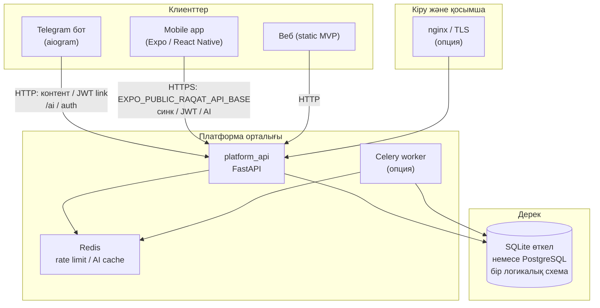
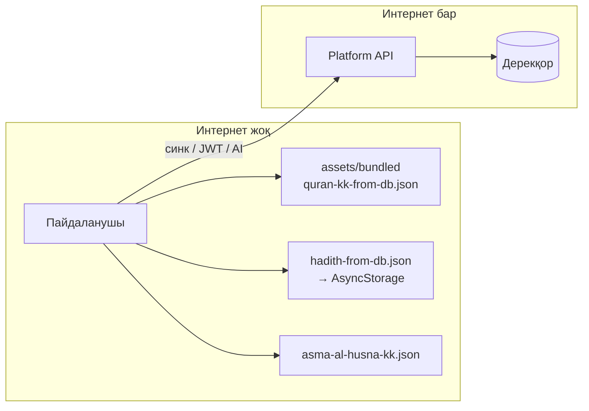

# RAQAT экожүйе құрылымы

Бұл репозиторий **modular monolith** бағытында ұйымдастырылған: клиенттер сыртта, ақыл орталықта.

## Сызба (қысқа)

```text
[Telegram Bot]  ─┐
[Mobile Expo]   ─┼──► Platform API (FastAPI) ──► PostgreSQL / Redis / (кейін) S3, Search
[Web static]    ─┘
```

## Толық экожүйе схемасы (орталық дерек + клиенттер)

**Идея:** шындық көзі — **платформа дерекқоры** (SQLite өткелінде / PostgreSQL мақсатта) және оны қорғайтын **Platform API**. Telegram бот, мобильді қолданба және веб сол дерек пен API арқылы байланысады; мобильдіде **Құран · сахих хадис · 99 есім** сияқты негізгі контент **интернетсіз** де жұмыс істеуі керек — ол бандл + жергілікті кэш (AsyncStorage) арқылы; **интернет болғанда** контент синхроны, JWT, AI прокси, профиль т.б. **автоматты** қосылады.

### Жоғары деңгей (орталықта дерек)



### Мобильді: офлайн vs онлайн

| Модаль | Не істейді | Жолы |
|--------|------------|------|
| **Офлайн** | Құран мәтіні (бандл JSON), хадис корпусы (бандл → AsyncStorage), 99 есім (`asma-al-husna-kk.json`), тәсбих дұғалар | `mobile/assets/bundled/*`, `hadithCorpus.ts`, `bundledHadithSeed.ts` |
| **Онлайн** | Контент инкременттік жаңарту (ETag / `metadata/changes`), аккаунт, AI чат, т.б. API арқылы | `contentSync.ts`, `docs/PLATFORM_GPT_HANDOFF.md` §2 (синк) |



### Бір дерек көзі → барлық платформа (мақсатты ағым)

**Мақсат:** дерекқорға **бір жол қосқанда** (немесе түзеткенде) барлық желі беттері **сол шындықты** көрсету — бірақ клиент түріне қарай механика әртүрлі.

| Клиент | Дерекке қалай жетеді | «Автомат» деген не |
|--------|----------------------|---------------------|
| **Platform API** | `platform_api` → `resolve_db_path()` (SQLite) немесе `DATABASE_URL` (PostgreSQL) | Жазба сақталған соң келесі оқу сұраныстарында жаңа мән |
| **Мобильді** | Офлайн: бандл; **онлайн:** `GET /api/v1/metadata/changes` + өзгерген id бойынша `/quran`/`/hadith` (`contentSync.ts`, `App.tsx`) | Интернет барда іске қосу және алдыңғы планға оралғанда синк қайталанады |
| **Telegram бот** | **Ұсынылған:** `RAQAT_BOT_API_ONLY=1` — тек API (`platform_content_service`) | Сервер DB жаңарғанда бот сұранысы бірден жаңа дерек алады |
| **Бот + жергілікті SQLite** | Бот машинасындағы `global_clean.db` платформа файлымен **синхрондалады** | Файлды жаңарту + бот процесін қайта іске қосу |
| **Веб** | Статикалық бет + `fetch` арқылы `GET /health`, `GET /api/v1/stats/content` | Контент **санын** API көрсетеді; толық мәтінді вебте көрсету келешекте API клиенті |
| **Жаңа APK (толық офлайн)** | `mobile/assets/bundled/*.json` — **белгілі бір уақыт снимогы** | Бір жол үшін жаңа build немесе пайдаланушының онлайн синкі |

**Инкременттік синк шарты:** `quran` және `hadith` кестелерінде **`updated_at`** болуы; INSERT/UPDATE кезінде мән жаңартылуы керек (`platform_api/content_reader.py` — `metadata_diff_for_since`).

**Жариялау тізбегі (оператор):**

1. Дерекқорда жол қосу/түзету, `updated_at` қойылғанын тексеру.
2. API **сол дерекқорды** оқитын етіп орналастыру (бір файл немесе PostgreSQL DSN).
3. Бот: мүмкіндігінше **API-only**; әйтпесе DB файлын көшіріп бот серверіне синхрондау.
4. Мобильді пайдаланушылары: интернет болғанда қолданба **автоматты** контент синк іске қосады (баптаудағы түйме де бар).
5. Тек офлайн снимокты жаңарту керек болса: экспорт скрипттері (`scripts/hadith_corpus_sync.py`, Құран экспорты) → `mobile/assets/bundled` → `npm run build:apk`.

Чеклист скрипті: [`scripts/content_single_source_checklist.sh`](scripts/content_single_source_checklist.sh).

### Бот және веб (қысқа)

- **Бот:** жоғарыдағы кесте; ұзақ мерзімде **бір көз = API** режимі экожүйені жеңілдетеді (`docs/PLATFORM_GPT_HANDOFF.md` §1.2).
- **Веб:** кем дегенде **статистика** API арқылы (`/api/v1/stats/content`); толық оқу интерфейсі келешекте сол API-ға байланады.

### Толық техникалық бриф

- Барлық қабаттар, JWT, AI прокси, инкременттік синхрон: [`docs/PLATFORM_GPT_HANDOFF.md`](docs/PLATFORM_GPT_HANDOFF.md).
- Құран: [`docs/QURAN_GPT_HANDOFF.md`](docs/QURAN_GPT_HANDOFF.md).
- Хадис: [`docs/HADITH_DATA_PROVENANCE.md`](docs/HADITH_DATA_PROVENANCE.md).

## Каталогтар

| Қалта | Мазмұны |
|-------|---------|
| [`platform_api/`](platform_api/) | Platform API (негізгі entry: `main.py`, модульдік қабат: `platform_api/app/`) |
| [`handlers/`](handlers/), [`bot_main.py`](bot_main.py) | Telegram бот |
| [`mobile/`](mobile/) | Expo мобильді қолданба |
| [`web/`](web/) | Статикалық веб MVP |
| [`services/`](services/), [`db/`](db/) | Ортақ Python сервистер мен дерекқор қабаты |
| [`apps/`](apps/) | Blueprint **картаcы** — қай entry қай жерде (көшіру жоспары) |
| [`packages/`](packages/) | Келешекте домендік Python пакеттері (қазір README) |
| [`infra/docker/`](infra/docker/) | Postgres + Redis `docker compose` |
| [`infra/nginx/`](infra/nginx/) | Edge proxy нұсқаулары |
| [`docs/`](docs/) | Соның ішінде [`PRODUCTION_BLUEPRINT_2M_USERS.md`](docs/PRODUCTION_BLUEPRINT_2M_USERS.md) |

## Жергілікті инфра

```bash
cd infra/docker && docker compose up -d
```

Содан кейін `.env` ішінде мысалы `RAQAT_REDIS_URL=redis://127.0.0.1:6379/0` — Platform API **AI rate limit** бірнеше worker арасында Redis арқылы ортақталады (`platform_api/ai_rate_limit.py`). `DATABASE_URL` — [`docs/MIGRATION_SQLITE_TO_POSTGRES.md`](docs/MIGRATION_SQLITE_TO_POSTGRES.md).

## Келесі қадамдар (build order)

`docs/PRODUCTION_BLUEPRINT_2M_USERS.md` §19: PG толық көшу → Alembic (`docs/ALEMBIC_BOOTSTRAP.md`) → Redis → rate limit + **exact AI cache** → **Celery worker** (`docker compose --profile workers`) → AI policy → admin → replica/search.

**Қазір іске асырылған:** Redis AI rate limit; **exact prompt cache** (`platform_api/ai_exact_cache.py`); **audit_events** (миграция 010 + `append_audit_event`); **Celery** скелеті (`platform_api/celery_app.py`, `raqat.ping` task).
