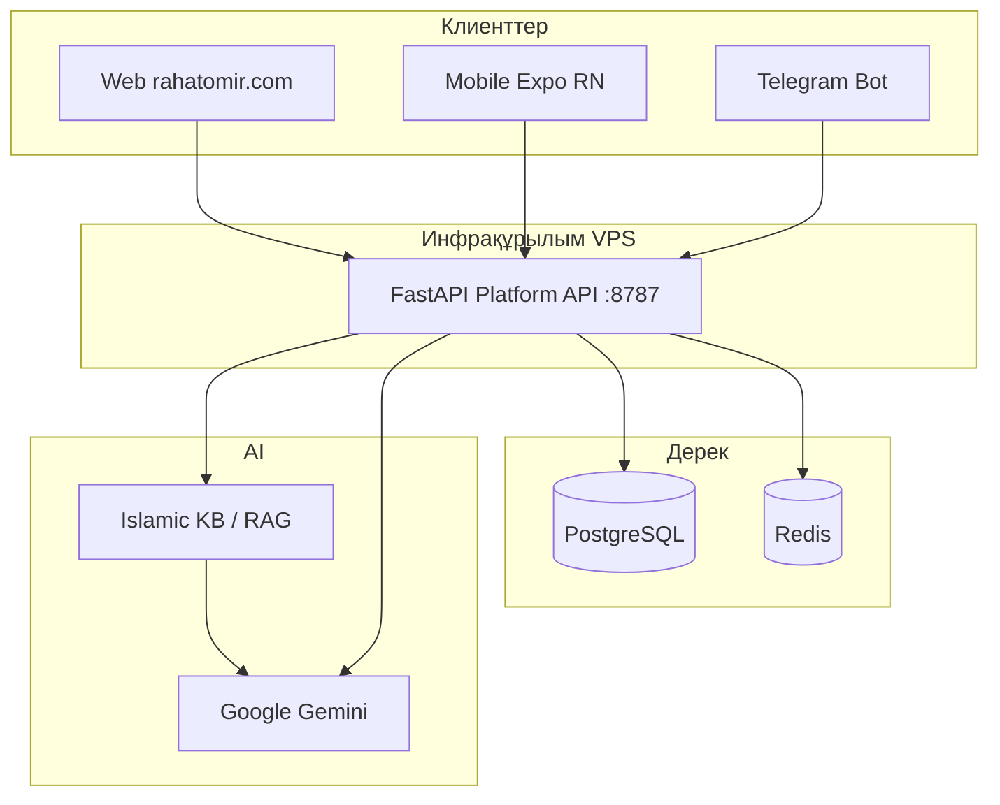

# RAQAT / RAHAT OMIR — толық платформа бағалау пакеті (Gemini)

**Күйі:** 2026-06-17  
**Мақсаты:** бұл **жалғыз файл** — сыртқы Gemini (немесе кез келген LLM) моделіне RAQAT платформасын толық бағалауға беруге арналған. Өнім, архитектура, діни саясат, сапа, тәуекелдер, release күйі, ашық сұрақтар — бәрі осы жерде.  
**Құпиялық:** `.env`, API key, keystore, пароль, private token **жоқ**. Тек public URL, архитектура, файл жолдары, командалар.

**Production URL-дар (ашық):**
- Веб: `https://rahatomir.com`
- API: `https://api.rahatomir.com`
- Halal Damu ресми: `https://halaldamu.kz`
- ҚМДБ/Муфтият: `https://muftyat.kz`, `https://fatua.kz`

---

## 0. Gemini-ге тапсырма (оқу нұсқауы)

Төмендегі платформаны **толық** бағала:

1. **Өнімдік құндылық** — Қазақстан мұсылманына нақты күндік пайдасы бар ма?
2. **Техникалық сапа** — mobile/web/API өндіріске дайын ба?
3. **Діни сенімділік** — Ханафи/Матуриди/ҚМДБ рамкасы, фетва емес AI, дерек көзі анықтығы.
4. **Тәуекелдер** — P0/P1 тізімі дұрыс па, не жетіспейді?
5. **Бәсекелестік** — Muslim Pro, Quran.com, Sajda, Tarteel сияқты қолданбалармен салыстыру.
6. **Шығару ұсынысы** — Play Store / кең жариялауға дайын ба, не кідірту керек?

Жауап форматы: Executive summary (5–10 bullet) → Strengths → Weaknesses → Risks → Prioritized recommendations (P0/P1/P2) → Release verdict (Go / No-Go / Go with conditions).

**Минус калибрлеу:** §1.1-тегі **«Minус емес»** және **«Кейін (P2)»** тармақтарын Weaknesses-ке қоспа; тек нақты кемшіліктер мен release blocker-лерді есепте.

---

## 1. Executive Summary

**RAQAT / RAHAT OMIR** — қазақ тіліндегі исламдық mobile + web + Telegram экожүйесі. Миссия: намаз, Құран/хатым, дұға, тәспіх, құбыла, халал тексеру, хадис, дін мен дәстүр, қажылық, AI көмекші — **бір қолданбада**, офлайнға жақын, Қазақстан заңы мен ҚМДБ бағытына сәйкес.

| Қабат | Технология | Күйі |
|-------|------------|------|
| Mobile | Expo SDK 54, RN 0.81.5, React 19 | **v1.1.0** (versionCode 10), release candidate |
| Android native | Kotlin: azan alarm, widget, qibla sensor | Белсенді даму, device QA |
| Web | Expo export → `rahatomir.com` | Deploy + stale-chunk health |
| Backend | FastAPI Platform API, Celery, Redis, PostgreSQL | Prod `api.rahatomir.com` ready |
| Bot | aiogram Telegram | AI proxy арқылы немесе тікелей Gemini |
| Data | SQLite (dev) / PostgreSQL (prod), bundled JSON | KB, Quran, hadith offline |

**Соңғы verification (2026-06-17):**
- `npm run lint` — pass
- Jest: **148 suites / 634 tests** — pass
- Android debug APK build — pass (Gradle 8.14, кириллица user path workaround: `GRADLE_USER_HOME=D:\gradle-home`)
- Production `/ready` — `ok`, backend `postgresql`, redis `ok`

**Негізгі күштер:**
- Кең модуль жиынтығы (12+ басты тайл)
- Офлайн Quran/hadith/dua каталогтары
- QCF4 604-бет хатым (Madinah glyph)
- KB-only AI саясаты + діни guardrail
- Halal Damu ресми интеграция + seed fallback
- Native Android azan full-screen + widget

**Негізгі әлсіз жақтар (қысқаша):** толық калибрленген тізім — **§1.1**. Негізгілері: тәжуид Sajda parity gap, azan OEM тәуекелі, діни scholar gate, APK өлшемі, release QA gate ашық, observability толық емес.

---

## 1.1 Негізгі минустар (калибрленген)

Бұл бөлім — Gemini Weaknesses үшін **ресми тізім**. Категориялар: нақты минус | тәуекел | minус емес | кейін (P2).

### Minус емес — бағалауда есептемеңіз

| Тармақ | Себебі |
|--------|--------|
| **12 dashboard тайл** | Өнім шешімі: толық модуль каталогы; hero + promos негізгі value береді (§2.2) |
| Тайл reorder / hide | P2 — санын өзгертпей, кейін |
| Onboarding personalization | P2 — release blocker емес |
| Көп модуль = «көп feature» | Күш ретінде қаралуы керек; minус емес |

### Өнім және өсу

| Минус | Күйі |
|-------|------|
| Аудитория proof кезеңінде | Proof мақсаты ~100 белсенді; retention/DAU деректері шектеулі |
| Mobile analytics жоқ | Plausible тек `rahatomir.com` (веб); APK install/DAU — Play Console сыртында |
| Account sync әлсіз | Bookmark, hatim құрылғылар арасында толық синхрон жоқ (P2 жоспар) |

### Техникалық

| Минус | Күйі |
|-------|------|
| APK ~114 MB | Asset pruning ашық (P1) |
| Azan OEM әртүрлілігі | Samsung/Xiaomi: battery opt, exact alarm, FSI — locked-screen real prayer QA **өтпеген** (P0) |
| Observability толық емес | `RAQAT_USAGE_STATS_SECRET` prod-та конфигурацияланбаған; орталық dashboard жоқ |
| Halal performance | Ұзын тізім + map marker — ескі Android-та баяу (P1) |
| Dev ergonomics | Windows кириллица user path → Gradle workaround (`GRADLE_USER_HOME`) |

### Quran / тәжуид

| Минус | Күйі |
|-------|------|
| **Sajda parity жоқ** | QCF V4 Tajweed COLR қаріптері жоқ; қазір **сөз деңгейінде** түс, әріп ішіндегі түс жоқ |
| Unicode tajweed Android | Nested `<Text>` color араб shaping үзеді — сүре тізімі WebView, хатым QCF4 workaround ішінара шешті |
| Hatim UI | Кіші экран modal safe-area / clip (P0) |

### Діни сенімділік

| Минус | Күйі |
|-------|------|
| Scholar review ашық | `namazContent.ts`, azan Arabic/KK, namaz learning — Hanafi sign-off жоқ (P0) |
| AI moderation | Pre-generation religious safety classifier production hardening керек (P0) |
| Контент белгілеу | Muftyat/Fatua scraped vs хадис аудармасы шатасу тәуекелі (P0) |
| Quran KK provenance | Bundle attribution vs verified import нақтылау керек (P0) |

### Release дайындығы

| Минус | Күйі |
|-------|------|
| Play release gate | AAB build + `release:play:check` толық өтпеген |
| Signing upgrade path | Жаңарту кілті сәйкестігі тексерілуі керек |
| Uncommitted жұмыс | Көп өзгеріс commit/deploy болмаған күйде (§21) |

### Бәсекелестермен салыстыру (құрылымдық gap)

| Область | Кім алда | RAQAT gap |
|---------|----------|-----------|
| Mushaf + тәжуид | **Sajda** | COLR glyph tajweed, premium mushaf UX |
| Namaz ecosystem | **Muslim Pro** | Көп calculation, calendar, tracker тереңдігі |
| AI тәжуид | **Tarteel** | Дауыс бойынша feedback, streak |
| Bookmark/sync, аудио | **Quran.com** | Экожүйе тереңдігі, көп аударма |

### Кейін шешіледі (P2) — minус ретінде есептемеңіз

- Тайл персонализация (12 санын өзгертпей)
- Onboarding flow
- Official Halal Damu / ҚМДБ partnership workflow
- 2M users scale blueprint іске асыру

**Шежіре / genealogy:** 2026-06-17 күні платформадан **толық алынып тасталды** (API, DB bootstrap, mobile, скрипттер). Ескі PG/SQLite кестелері prod-та orphan болуы мүмкін — қолданба оларды енді қолданбайды.

---

## 1.2 Минустар бойынша жұмыс (2026-06-17)

| Минус | Статус |
|-------|--------|
| Hatim modal safe-area (sheet clip) | **Жасалды** — `modalSheetInsets.ts`, `HatimSurahSearchSheet`, `QuranNavWheelSheet` |
| AI moderation pre-generation | **Жасалды** — `moderate_ai_reply` + `enforce_ai_reply_safety` (sync + Celery) |
| Mobile analytics жоқ | **Ішінара** — `app_launch` event `usageAnalytics` арқылы |
| Observability secret | **Жасалды** — `.env.example` `RAQAT_USAGE_STATS_SECRET` |
| Muftyat/Fatua labeling | **Жасалды** — `articleExcerptBadge` тізім карточкаларында |
| Quran KK provenance | **Жасалды** — `QURAN_KK_TEXT_PROVENANCE_KK`, Hatim settings |
| Dashboard prayer race | **Бұрыннан бар** — `prayerLoadSeqRef` guard |
| Startup allSettled | **Бұрыннан бар** — `App.tsx` post-boot |
| Sajda tajweed parity | **Ашық** — QCF V4 COLR керек |
| Azan OEM locked-screen QA | **Жұмыс істелуде** — QA скрипт + Settings батырмасы; Samsung A515F immediate broadcast: audio OK, UI lock screen артында |
| Scholar review | **Ашық** — сыртқы gate |
| APK 114 MB | **Ашық** — asset pruning P1 |
| Play AAB gate | **Ашық** — release process |

---

## 2. Өнім позициялау және USER · VALUE · UX

### 2.1 Солтүстік жұлдыз

| Деңгей | Мақсат |
|--------|--------|
| **Proof** | ~100 белсенді пайдаланушы — идея сатылады |
| **Growth** | 1000+ тұрақты өсу |
| **Daily value** | Намаз уақыты + күнделікті аят + бір AI сұрақ |
| **Simple UX** | Бір басу → бір нәтиже; басты экран тығыз емес |

### 2.2 Негізгі модульдер (Dashboard 12 тайл)

| Модуль | Экран/файл | Мән |
|--------|------------|-----|
| Намаз | `PrayerTimesScreen`, `PrayerAzanScreen` | Уақыт, азan, widget |
| Құран | `QuranListScreen`, `QuranSurahScreen` | Сүре тізімі, оқу, аудио |
| Хатым | `QuranMushafBookScreen`, `HatimScreen` | 604 бет, прогресс |
| Тәжуид | `TajweedGuideHub`, Quran tajweed toggle | Al Quran Cloud quran-tajweed |
| Хадис | `HadithHubScreen` | Source-only KK саясаты |
| Халал | `HalalScreen` | Damu registry, scan, map |
| AI | `RaqatAIChatScreen` | KB-only Islamic helper |
| Дұға | `DuasScreen` | Каталог, мензикир |
| Тәспіх | `TasbihScreen` | Санау |
| Қажылық | Hajj screens | Муфтият гид |
| Дін мен дәстүр | `KazakhTraditionScreen` | Кітаптар, дәстүр |
| Сират | Seerah | Бейне/контент |

**Dashboard 12 тайл — өнім шешімі (minус емес):** launcher grid-те **12 тайл санаты бойынша қалдырылады**. Бұл кең модуль каталогы — бір қолданбада барлық негізгі бөлімге тікелей кіру. Басты экранның негізгі value-сы hero (келесі намаз, құбыла) және promos арқылы беріледі; тайл саны азайту, reorder немесе персонализация — **кейінгі кезең (P2)**, analytics және onboarding кейін шешіледі. **Gemini бағалауда 12 тайлды әлсіз жақ ретінде есептемеңіз.**

### 2.3 Бәсекелестерден үйрену (қабылдау идеялары)

| Қолданба | RAQAT-қа алынатын идея |
|----------|------------------------|
| Muslim Pro | Көп namaz calculation, azan, calendar |
| Quran.com / Majeed | Таза оқу, көп аударма, bookmark, offline |
| **Sajda** | Mushaf режимінде **QCF glyph + түсті тәжуид** (біз QCF4 қолданамыз) |
| Tarteel | AI тәжуид feedback, streak |
| Pillars | Namaz tracker, Ramadan focus |

---

## 3. Пайдаланушы метрикалары (нақты сан — шектеу)

**Маңызды:** бұл репозиторийден **«дәл қазір онлайн N адам»** санын алу мүмкін емес — production DB credentials жоқ, analytics dashboard жария емес.

### 3.1 Қалай саналады

| Көрсеткіш | Кесте/көз | Мағынасы |
|-----------|-----------|----------|
| `platform_users` | PostgreSQL | JWT тіркелген mobile/web |
| `user_preferences` | PostgreSQL | Telegram бот prefs |
| `event_log` active_users | 24h/7d/30d | Бот оқиғалары, `user_id` |
| `client_usage_events` | sessions | App/web pageview, session_id |
| Plausible | `rahatomir.com` | **Тек веб**, APK емес |
| Play Console | — | Install/DAU (сыртқы панель) |

### 3.2 Нақты санды алу командалары (VPS/admin)

```bash
# VPS PostgreSQL
python scripts/print_pg_usage_stats.py
python scripts/print_usage_stats.py

# API (secret қажет, prod-та конфигурацияланбаған болуы мүмкін)
GET /api/v1/client/usage/summary
Header: X-Raqat-Usage-Stats-Secret: <secret>

# Telegram admin (ADMIN_USER_IDS)
/health  → Users with prefs, events_last_15m
/stats   → Active users 24h, top events
```

### 3.3 Өнім шындығы (2026-06)

`docs/RAQAT_PLATFORM.md`: **0 user = 0 экожүйе** — техника бар, бірақ өнімділік нақты адамдардың қайта оралуымен өлшенеді. Proof мақсаты: ~100 белсенді.

**Бұл minус емес, өріс:** ерте кезеңдегі өнім; метрика инфра бар (`platform_users`, `client_usage_events`, Telegram `/stats`), бірақ орталық dashboard және mobile analytics әлі толық емес (§1.1).

---

## 4. Архитектура



### 4.1 Identity

- Telegram `user_id` ↔ `platform_user_id` (UUID) ↔ JWT `sub`
- `POST /auth/link/telegram` — бот/mobile бір профиль
- AI чат: `platform_ai_chat_messages` (бот + API бір кесте)

### 4.2 DB абстракция

- `db/get_db.py` — `with get_db_writer() as conn:`
- `DATABASE_URL` postgres болса → SQLite миграциялары өтпейді
- `db/dialect_sql.py` — `?` / `%s` үйлесімі

### 4.3 Өндіріс posture

| Компонент | Prod |
|-----------|------|
| SQLite | **Жоқ** — тек dev/test |
| Redis | **Міндетті** (`RAQAT_REDIS_REQUIRED=1`) |
| PostgreSQL | **Міндетті** |
| Monitoring | `/metrics`, `/metrics/json` — Prometheus/Grafana инфрада |
| AI cache | Exact + semantic (`RAQAT_AI_SEMANTIC_CACHE=1`) |
| Celery | Retry/timeout бар; DLQ — roadmap |

---

## 5. Технология стегі

### 5.1 Mobile (`mobile/`)

| Пакет | Нұсқа |
|-------|-------|
| expo | ~54.0.35 |
| react-native | 0.81.5 |
| react | 19.1.0 |
| react-navigation | 6.x |
| react-native-reanimated | 4.x |
| react-native-webview | 13.15.0 |
| @shopify/flash-list | 2.0.2 |

**App:** `kz.raqat.app`  
**Нұсқа:** `1.1.0` (versionCode `10`)  
**API base:** `https://api.rahatomir.com`  
**Deep links:** `imamai://`, `raqat://`

### 5.2 Backend (`platform_api/`)

- FastAPI, uvicorn
- JWT auth, rate limit (Redis)
- Islamic KB RAG (`platform_api/islamic_kb/`)
- AI routes (`/api/v1/ai/*`) — Gemini proxy, guardrails
- Halal Damu proxy
- Client monitoring (`/api/v1/client/usage`, `/errors`)
- Celery workers (`platform_api/celery_tasks.py`)

### 5.3 Bot

- `bot_main.py`, `handlers/`
- Admin: `/health`, `/stats`, feedback
- `services/ops_service.py` — analytics snapshot

### 5.4 Scripts / CI

- `scripts/vps_deploy_web.ps1`, `web-release-health.ps1`
- `.github/workflows/` — smoke, refactor, content-release
- `scripts/run_freeze_gate.ps1`

---

## 6. Репозиторий картасы

| Қалта | Рөлі |
|-------|------|
| `mobile/src/screens/` | Барлық негізгі экрандар |
| `mobile/src/components/` | UI, Quran renderer, dashboard |
| `mobile/src/navigation/` | Stacks, deep links, Android back |
| `mobile/src/services/` | Notifications, AI, bootstrap |
| `mobile/src/api/` | API clients |
| `mobile/src/storage/` | AsyncStorage cache/prefs |
| `mobile/src/quran/` | Mushaf layout, QCF4, audio |
| `mobile/src/i18n/` | Kazakh baseline `kk.ts` |
| `mobile/assets/bundled/` | Offline JSON (Quran, hadith, duas, halal seed) |
| `mobile/android/.../kz/raqat/app/` | Kotlin native modules |
| `platform_api/` | FastAPI |
| `db/` | Schema, migrations |
| `services/` | Business logic |
| `handlers/` | Telegram |
| `tests/` | Python tests |
| `docs/` | Handoff, ops, roadmap |

---

## 7. Модульдер — техникалық тереңдік

### 7.1 Dashboard (`DashboardScreen.tsx`)

- Next prayer hero, prayer tracker, qibla entry
- 12 launcher tiles (custom thumbs) — **санаты бойынша тұрақты**, reorder/hide кейін
- Quran continue reading
- Halal Damu rotator (auto-advance, AppState pause — battery fix)
- Daily promos: AI, hadith, hajj, tradition

### 7.2 Намаз және Azan

**Файлдар:**
- `mobile/src/api/prayerTimes.ts`
- `mobile/src/services/prayerNotifications.ts`
- `mobile/src/services/prayerFullScreenAzan.ts`
- `mobile/src/screens/PrayerAzanScreen.tsx`
- `PrayerAzanAlarmScheduler.kt`, `PrayerAzanAlarmReceiver.kt`
- `PrayerAzanNativePlayer.kt`, `PrayerLegacyNotificationCleaner.kt`
- `PrayerWidgetModule.kt`, `PrayerWidgetViews.kt`

**Мінез-құлық:**
- Android: native exact alarm + full-screen intent + native audio (`adhan_haramain`)
- `MainApplication.kt`: boot/app start кезінде `PrayerAzanAlarmScheduler.restore()`
- `prayerNotifications.ts`: cache null болғанда `cancelAllPrayerNotifications()` шақырмайды (azan жойылмауы)
- Kazakhstan: Muftyat resource path, fallback сақталған
- v1.1.0: deep link query params (`label`, `time`, `soundId`, `salatKey`, `nativeAudio`)
- Settings diagnostics: version, API, notification, scheduled alarm count, exact alarm, FSI

**QA тәуекелдері:**
- OEM battery optimization
- `SCHEDULE_EXACT_ALARM` / `USE_FULL_SCREEN_INTENT` рұқсаттары
- Locked-screen real prayer time test міндетті
- Samsung SM-A515F, SM-F956B device QA жүргізілген

### 7.3 Құбыла

**Файлдар:**
- `QiblaSensorContext.tsx`
- `QiblaDeviceHeadingWatcher.kt` (native rotation vector)
- `PrayerWidgetModule.kt` — `startDeviceHeadingUpdates`
- `qiblaNativeDeviceHeading.ts`

**Мінез-құлық:**
- Android: native heading Expo `watchHeadingAsync` fallback-тан бұрын
- Widget sensor service: foreground notification болдырмау үшін тоқтатылған
- Stable mode only in Settings (crash fix: `QiblaSensorProvider жоқ`)

### 7.4 Quran, Hatim, Mushaf

**Экрандар:** `QuranListScreen`, `QuranSurahScreen`, `QuranMushafBookScreen`, `HatimScreen`

**Render backend** (`mushafPageRenderBackend.ts`):

| Backend | Сипаттама |
|---------|-----------|
| `qcf4` | QCF4 JSON + per-page fonts — **хатым әдепкі** (Quran.com clone theme) |
| `text-hafs` | Unicode + typography |
| `webp` / `svg` | CDN raster/SVG 604 page |

**Тәжуид (маңызды — 2026-06-17 жаңарту):**

| Кезең | Мәселе | Шешім |
|-------|--------|-------|
| Бұрын | Tajweed ON → `text-hafs` Unicode + nested `<Text>` color → Android араб үзіледі | — |
| Бұрын | `backgroundColor` fallback — «ойыншық» көрініс | — |
| **Қазір** | Хатым: **QCF4 сақталады** — Sajda сияқты glyph mushaf | `mushafBookEffectiveRenderBackend` өзгерісі |
| **Қазір** | Сүре тізімі Android: **WebView HTML** Chromium араб shaping | `TajweedColoredArabicText.tsx` |
| **Қазір** | Түстер: [Al Quran Cloud tajweed-guide](https://alquran.cloud/tajweed-guide) палитрасы | `tajweedRulesCatalog.ts` |
| Келешек | Sajda деңгейінде әріп ішінде түс | **QCF V4 Tajweed COLR** қаріптері (King Fahd Complex) |

**Дерек:**
- Bundled: `quran-uthmani-full.json`, `hadith-sahih-seed.json`, KK translations
- API: `api.alquran.cloud` — `quran-tajweed` edition
- KK мағына: Ерлан Алимулы verified import (`data/quran_kk_verified.json` — репоға кірмеуі мүмкін)
- Transliteration: koran.kz + algorithm backfill

**QCF4 файлдар:**
- `MushafBookPageQcf4.tsx`, `loadQcf4Page.ts`, `qcf4FontLoader.ts`
- Word-level tajweed color on glyphs (`tajweedWholeWordRules`)

### 7.5 Halal

- `HalalScreen.tsx`, `halalDamuWp.ts`, `halal-products-seed-kz.json`
- Official registry + seed fallback when API empty
- Barcode/photo AI — `halalVisionMachineLines.ts` protocol leak blocked
- Map WebView — performance risk on old devices
- Disclaimer: AI фетва емес

### 7.6 AI және Islamic KB

**Mobile:** `RaqatAIChatScreen`, `IslamicKbSearchScreen`, `OfficialKnowledgePortalScreen`

**Backend:**
- `ai_routes.py`, `ai_proxy.py`, `islamic_kb/rag.py`
- `ai_reply_guards.py`, `ai_safety_moderation.py`
- `ai_qa_sources.py`

**Саясат (`aiRequestPolicy.ts`):**
- `AI_RELIGIOUS_COMPLIANCE_GUARDRAIL_KK`
- Kazakhstan law, QMDB/Fatua/Muftyat, Hanafi madhhab, Maturidi aqida
- No takfir, extremism, violence, sectarian agitation
- AI — фетва емес; ресми көз/ұстазға жіберу

**Client:** `raqatAiKbOnly: true` in app.config

### 7.7 Hadith

- `hadithCorpus.ts` — source-only policy for unapproved KK
- Bundled: `hadith-sahih-seed.json`, `hadith-from-db.json`, `extracted-hadith-muftyat.json`
- UI disclaimers on source/context
- Scraped Muftyat articles — article/excerpt labeling risk (P0 backlog)

### 7.8 Дін мен дәстүр, маусымдық

- `KazakhTraditionScreen`, `traditionBooksCatalog.ts`
- Hajj: `HajjMuftyatGuide`, Talbiyah hero, Kaaba live modal
- Kurban/Ait seasonal content

### 7.9 Telegram Bot

- Namaz, Quran, hadith, AI, voice
- Admin analytics `/health`, `/stats`
- Platform API proxy when configured

---

## 8. Діни саясат және Қазақстан compliance

### 8.1 Қағидаттар

1. **Ханафи мәзхабы** — практикалық fiqh default
2. **Матуриди ақида** — creed-sensitive language
3. **ҚМДБ / Fatua.kz / Muftyat.kz** — ресми көз posture
4. **Қазақстан заңы** — қоғамдық келісім, экстремизмге қарсы
5. **AI фетва емес** — educational helper ғана

### 8.2 Иске асырылған safeguard-тар

- `withReligiousComplianceGuardrail()` — AI prompts
- Hadith source-only tests
- `religiousComplianceCopy.test.ts`
- `offlineAutoTranslationSafety.ts` — corrupt UI string block
- Production crash screen — raw error жоқ
- `docs/operations/religious-content-review-packet-2026-06.md` — external scholar checklist

### 8.3 Ашық gate (сыртқы review керек)

- [ ] `namazContent.ts` — Hanafi scholar sign-off
- [ ] `namazLearningContent.ts`, `namazMenzikir.ts`
- [ ] Azan Arabic blocks + KK/RU/EN meanings
- [ ] Backend AI moderation classifier production hardening
- [ ] Muftyat scraped content — hadith translation емес деп белгілеу

---

## 9. i18n және offline translation

- Baseline: **Kazakh** (`mobile/src/i18n/kk.ts`)
- Runtime locales: `kk`, `ru`, `en`, `ky` (full QA only these four)
- **Online machine translation UI үшін қолданылмайды**
- Offline bundle: `offline-auto-translations-core.json`
- Corrupt fragment sanitizer — placeholder, `undefined`, code leak block

---

## 10. Android Native Modules

| Module | Файл | Мақсаты |
|--------|------|---------|
| Azan alarm | `PrayerAzanAlarmScheduler.kt` | Exact alarm schedule |
| Azan receiver | `PrayerAzanAlarmReceiver.kt` | Full-screen + audio trigger |
| Native player | `PrayerAzanNativePlayer.kt` | `adhan_haramain` MP3 |
| Legacy cleaner | `PrayerLegacyNotificationCleaner.kt` | Ескі notification тазалау |
| Widget | `PrayerWidgetModule.kt`, `PrayerWidgetViews.kt` | Home prayer widget |
| Qibla heading | `QiblaDeviceHeadingWatcher.kt` | Compass sensor |
| Widget sensor | `QiblaWidgetSensorService.kt` | (intentionally stopped — no FGS notif) |

**Permissions (review):** `SCHEDULE_EXACT_ALARM`, `USE_FULL_SCREEN_INTENT`, location, notifications, camera (halal scan).

---

## 11. Web deploy

- Export: `mobile/scripts/export-web.ps1` / `export-web.sh`
- Deploy: `scripts/vps_deploy_web.ps1`
- Health: `scripts/web-release-health.ps1` — stale JS chunk detection
- Plausible analytics: `EXPO_PUBLIC_PLAUSIBLE_DOMAIN=rahatomir.com` (web only)
- CDN assets: `rahatomir.com/assets/quran`, `assets/bundled`

---

## 12. API endpoints (негізгілер)

| Method | Path | Сипаттама |
|--------|------|-----------|
| GET | `/health` | Liveness |
| GET | `/ready` | DB + Redis readiness |
| GET | `/metrics` | Prometheus |
| POST | `/api/v1/ai/chat` | AI chat (JWT or secret) |
| GET | `/api/v1/usage/me` | User usage ledger |
| POST | `/api/v1/client/usage` | Client analytics event |
| POST | `/api/v1/client/errors` | Client error report |
| GET | `/api/v1/client/usage/summary` | Admin stats (secret) |
| GET | `/metadata/changes` | Incremental sync |

---

## 13. Сапа және verification

### 13.1 Автоматты тесттер (2026-06-17)

```powershell
cd mobile
npm run lint          # tsc --noEmit
npm test -- --ci      # 148 suites, 634 tests
```

```powershell
cd ..
.\.venv\Scripts\python.exe -m pytest tests -q
```

### 13.2 Mobile build

```powershell
cd mobile
npm run build:apk        # release APK
npm run build:apk:debug  # debug APK
npm run build:aab        # Play bundle
npm run release:play:check
```

**APK (алдыңғы optimized release snapshot):** ~114 MB  
**SHA256 (reference):** `87b6c8d4a5bb4324ec372370f4d0c927e3cd8ffc550454a499fd76498d486090`

### 13.3 Device QA (фактілер)

| Күні | Құрылғы | Нәтиже |
|------|---------|--------|
| 2026-05-24 | Device QA changelog | Core navigation sweep |
| 2026-06-13 | SM_G965F | v1.1.0 release readiness — crash-free sweep |
| 2026-06-17 | SM-A515F, SM-F956B | Azan schedule, qibla native sensor, tajweed manual QA |

**v1.1.0 gate қалған:**
- [ ] Play AAB build + `release:play:check`
- [ ] Locked-phone azan at real prayer time
- [ ] Exact alarm permission granted on test device
- [ ] Signing key match for upgrade path (SHA-256: `64274957c7fcd248f8e5580ae2b844ba5188809e9b757468d174bb455cc6fbdb`)

---

## 14. Соңғы инженерлік жұмыс (2026-06-09 — 2026-06-17)

### 14.1 Azan
- Native full-screen alarm restore on app start
- Prayer notification cancel guard (cache null)
- Native audio player
- Deep link title/time fix

### 14.2 Qibla
- Native `QiblaDeviceHeadingWatcher` (Samsung Expo heading unreliable)
- Settings crash fix

### 14.3 Tajweed
- `tajweedColoredRuns()` — tag splits ішінде араб байланыс
- `nestedInText` — double Text wrapper fix
- **QCF4 mushaf when tajweed ON** (not text-hafs)
- Android surah list: WebView HTML colored Arabic
- Al Quran Cloud official color palette

### 14.4 UI/Brand
- Logo, splash, notification icon refresh
- Dashboard hero, tile thumbs
- Kaaba live, Talbiyah backgrounds

### 14.5 Data/Backend
- PostgreSQL schema (`db/postgresql_schema.py`)
- Halal products seed KZ update
- Religious content review packet

---

## 15. Белгілі тәуекелдер және backlog

§1.1 минустарымен сәйкес: P0 = release blocker, P1 = сапа, P2 = кейін (minус емес).

### P0 — кең жариялау алдында

| # | Тапсырма | Owner |
|---|----------|-------|
| 1 | Backend AI religious safety moderation pre-generation | Backend |
| 2 | Hanafi scholar review: `namazContent.ts` | Religious |
| 3 | Dashboard prayer load latest-request guard | Mobile |
| 4 | Quran/Hatim modal safe-area pass | Mobile |
| 5 | Muftyat/Fatua article labeling | Content |
| 6 | Quran KK attribution vs bundle provenance | Content |
| 7 | Real-device locked-screen azan QA | Android QA |
| 8 | QCF V4 Tajweed fonts OR WebView mushaf tajweed parity with Sajda | Mobile |

### P1 — сапа

| # | Тапсырма |
|---|----------|
| 1 | Halal list virtualization |
| 2 | Map marker chunk loading |
| 3 | AI chat request guards |
| 4 | Startup Promise.allSettled |
| 5 | Asset/bundle pruning |
| 6 | Observability dashboards (Prometheus/Grafana) |
| 7 | `RAQAT_USAGE_STATS_SECRET` configure on prod |

### P2 — өсу

| # | Тапсырма |
|---|----------|
| 1 | Play Store privacy/data safety full |
| 2 | Onboarding personalization (тайл reorder/hide — **12 санын өзгертпей**, кейін) |
| 3 | Account sync (bookmarks, hatim) |
| 4 | Official Halal Damu/QMDB partnership workflow |

---

## 16. Release verdict criteria («World-Class»)

Дайын деп саналады, егер:

- [ ] Public screen-де raw error / protocol text / placeholder жоқ
- [ ] Діни жауаптар source-grounded + QMDB/Hanafi/Maturidi framed
- [ ] Quran/Hatim small Android phones-та clip жоқ
- [ ] Azan locked phone-да жұмыс істейді
- [ ] Halal source labels анық (official vs seed vs AI)
- [ ] `lint` + full Jest + release build + Play validator pass
- [ ] Web deploy health pass
- [ ] Scholar sign-off on sensitive worship copy
- [ ] Tajweed mushaf Sajda-ға жақын визуал (QCF4 minimum)

---

## 17. Диагностика (жиі қателер)

| Симптом | Себеп | Әрекет |
|---------|-------|--------|
| Web white screen | Stale JS chunk | `web-release-health.ps1` |
| Azan жоқ | Alarm schedule 0 | App restart, permissions, `PrayerAzanAlarmScheduler.restore` |
| Azan duplicate sound | Notification + native audio | Channel/receiver path |
| Widget stale | Payload not synced | Open app, refresh prayer |
| AI жауап жоқ | API/env | `/ready`, API base |
| Tajweed әріп үзіледі | Unicode Text spans | QCF4 mushaf mode / WebView |
| Gradle build fail (Cyrillic path) | Windows user path | `GRADLE_USER_HOME=D:\gradle-home` |
| Debug APK white screen | Metro not running | Bundled debug build (`debuggableVariants = []`) |

---

## 18. Пайдалану командалары (толық)

### Mobile
```powershell
Set-Location d:\opt\raqat-ai\mobile
npm install
npm run lint
npm test -- --ci
npm run build:apk
npm run build:aab
npm run release:play:check
npm run android:live
npm run qa:android:release
```

### Web
```powershell
Set-Location d:\opt\raqat-ai
powershell -ExecutionPolicy Bypass -File scripts/vps_deploy_web.ps1
powershell -ExecutionPolicy Bypass -File scripts/web-release-health.ps1
```

### API local
```powershell
Set-Location d:\opt\raqat-ai
.\scripts\run_platform_api.ps1 -Dev -FreePort
```

### Python tests
```powershell
.\.venv\Scripts\python.exe -m pytest tests -q
```

### Usage stats (VPS)
```bash
python scripts/print_pg_usage_stats.py
python scripts/print_usage_stats.py
```

---

## 19. Қосымша құжаттар (репода)

| Файл | Мазмұны |
|------|---------|
| `docs/PLATFORM_GPT_HANDOFF.md` | Алдыңғы platform handoff (2026-06-12) |
| `docs/QURAN_GPT_HANDOFF.md` | Quran data/translit deep dive |
| `docs/RAQAT_PLATFORM.md` | Product north star USER·VALUE·UX |
| `docs/RAQAT_ISLAMIC_KNOWLEDGE_RAG.md` | KB/RAG policy |
| `docs/HADITH_DATA_PROVENANCE.md` | Hadith sources |
| `docs/PRODUCTION_POSTURE.md` | PG/Redis/monitoring |
| `docs/RELEASE_1MIN_CHECKLIST.md` | Quick release check |
| `docs/mobile/changelog/2026-06-13-v1.1.0-release-readiness.md` | v1.1.0 QA |
| `docs/operations/religious-content-review-packet-2026-06.md` | Scholar checklist |
| `docs/roadmap/feature-freeze-2026-06.md` | Feature freeze scope |
| `docs/PRODUCTION_BLUEPRINT_2M_USERS.md` | Scale vision |

---

## 20. Gemini бағалау сұрақтары (checklist)

**Алдымен §1.1 оқы:** 12 тайл, onboarding, P2 тармақтарын Weaknesses-ке қоспа.

### Product
- [ ] Hero (namaz + qibla) және daily value 10 секундта түсінікті ме?
- [ ] 12 тайл grid навигацияға ыңғайлы ма? *(санын азайту — scope емес, 12 қалдырылады)*
- [ ] Daily value (namaz + ayah + AI) нақты көрінеді ме?
- [ ] Қазақстан аудиториясына локализация жеткілікті ме?

### Technical
- [ ] Architecture scale-ға дайын ба (PG, Redis, Celery)?
- [ ] APK 114MB қабылданарлық ма?
- [ ] Offline-first жеткілікті ме?
- [ ] Test coverage (634 tests) жеткісіз областьдар қайда?

### Religious
- [ ] AI guardrails жеткілікті ме?
- [ ] Hadith/Quran attribution дұрыс па?
- [ ] Namaz fiqh scholar review mandatory дұрыс па?

### Competitive
- [ ] §1.1 бәсекелестік gap кестесі дұрыс па?
- [ ] Sajda mushaf/tajweed gap қаншалықты критикалық?
- [ ] Muslim Pro namaz features gap release blocker ме?
- [ ] Tarteel AI tajweed feedback — v1.1 scope сыртында ма?

### Release
- [ ] v1.1.0 Go / No-Go / Conditional Go? (§1.1 release минустары негізінде)
- [ ] Ең алдымен не істеу керек (top 5 P0)?

---

## 21. Қорытынды контекст (ағымдағы git күйі)

Репода **көп uncommitted өзгеріс** бар (2026-06-17 snapshot): mobile v1.1.0 polish, Android native azan/qibla, tajweed render fixes, PostgreSQL schema, halal seed, QA screenshots, docs. Бұл бағалау пакеті **жобаның мақсатты күйін** сипаттайды; нақты production deploy commit-і әрқашан VPS/Play Console-дан тексерілуі керек.

---

**Файл соңы.** Бұл — Gemini-ге жіберуге арналған **жалғыз толық** бағалау пакеті. Жаңарту керек болса, осы файлды жаңартып, күнін өзгертіңіз.
