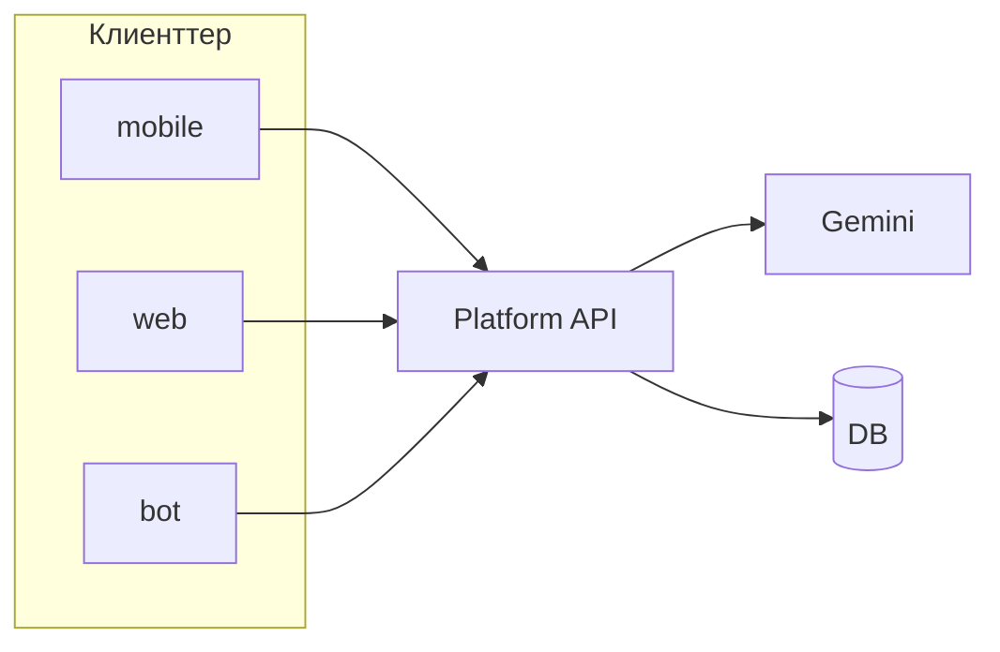

# RAQAT — келесі архитектура: орталық API, AI, пайдаланушы жүйесі

Мақсатты күй (сіздің 3 тармаққа сәйкес). Іске асыру **кезең-кезеңімен**; төменде рет, тәуелділіктер және API шолуы.

---

## 1. AI-ды орталыққа шығару

**Мақсатты ағын:** `Bot → Platform API → AI (Gemini)`  
**Қазіргі өткел:** бот `services/genai_service` + `handlers/ai_chat.py` арқылы Gemini-ға **тікелей** қосылады.

### Неге API арқылы

- Клиенттерде API кілті болмайды; квота, лог, фильтр, модель таңдауы бір жерде.
- Rate limit + абуз бақылау орталықтан.

### Кезеңдері (қысқа)

1. ~~`platform_api`-та **прокси endpoint** (`POST /api/v1/ai/chat`)~~ — **орындалды** (`platform_api/ai_routes.py`, `ai_proxy.py`). Құпия: `RAQAT_AI_PROXY_SECRET`, header `X-Raqat-Ai-Secret`.
2. ~~Ботта `ask_genai` → HTTP~~ — **орындалды** (`services/genai_service.py`: `RAQAT_PLATFORM_API_BASE` + `RAQAT_AI_PROXY_SECRET` толтырылса API, әйтпесе тікелей Gemini).
3. Мобильді / веб кейін сол endpoint-пен қосылады.

### Тәуелділіктер

- API серверінде `GEMINI_API_KEY` (немесе сервис аккаунты); `.env` тек серверде.
- **Пайдаланушы идентификаторы** (төмендегі кестемен) — лимит пен тарих үшін қажет.

**Қазіргі endpoint-тер (`platform_api`):**

| Метод | Жол | Құпия |
|--------|-----|--------|
| POST | `/api/v1/ai/chat` | `X-Raqat-Ai-Secret` |
| POST | `/api/v1/ai/analyze-image` | сол |
| POST | `/api/v1/ai/transcribe-voice` | сол |
| POST | `/api/v1/ai/tts` | сол |
| GET | `/api/v1/quran/surahs`, `/quran/{surah}`, `/quran/{surah}/{ayah}` | опция: `X-Raqat-Content-Secret` (`RAQAT_CONTENT_READ_SECRET`) |
| GET | `/api/v1/hadith/{id}` | сол |
| GET | `/api/v1/metadata/changes` | ETag, `If-None-Match` → 304; `since` сұрауы (аудит) |

**Кейін:** клиентке арналған API key немесе JWT; AI үшін rate limit user_id бойынша.

---

## 2. API-ды негізгі ядро ету

**Мақсат:** барлық клиенттер **бір HTTP API** арқылы:

| Клиент | Қазіргі дерек/логика | Келешек |
|--------|----------------------|---------|
| **mobile** | Aladhan тікелей, кейбір экрандарда дерек жергілікті | Құран/хадис оқу, баптаулар, AI — API |
| **web** | Статикалық | Кіру, профиль, жаңалық — API |
| **bot** | SQLite + Gemini тікелей | SQLite қалуы мүмкін, бірақ **AI және ортақ бизнес-логика** → API |

### API топтары (жоспар)

| Prefix | Мазмұны |
|--------|---------|
| `/api/v1/public` | Денсаулық, ашық статистика |
| `/api/v1/content` | Құран/хадис оқу (кеш, нұсқа) |
| `/api/v1/ai` | Чат / completion прокси |
| `/api/v1/auth` | Тіркелу, кіру, токен жаңарту |
| `/api/v1/users` | Профиль, тарих |

Қазіргі MVP: `/health`, `/api/v1/info`, `/api/v1/stats/content` — `platform_api/main.py`.

---

## 3. User system: login, profile, history

### Минималды модель

- **Тіркелу / кіру:** email+password немесе OAuth (Telegram Login, Google) — шешімді бір рет таңдау керек.
- **Сессия:** JWT (access + refresh) немесе серверлік сессия + cookie (веб үшін ыңғайлы).
- **Профиль:** аты, тіл, қалай қалпы (қазіргі `user_preferences` кестесіне жақын өрістер).
- **Тарих:** AI сұраулары, Құран ашылған сүрелер, хатм — оқиға кестесі (`user_events` немесе бөліп: `ai_conversation`, `reading_progress`).

### Дерекқор

- Жаңа кестелер: `users` (id, email_hash, created_at), `auth_identities` (oauth), `sessions` / refresh токендер.
- Боттағы `user_id` (Telegram) ↔ платформа `user_id` байланысы: `user_links` (telegram_user_id, platform_user_id).

### Кезегі

1. Auth схемасы + миграция.  
2. Ботта опционалды «аккаунтты байланыстыру».  
3. Профиль API.  
4. Тарих жазу (AI прокси іске қосылғанда бірден лог).

---

## Сурет: мақсатты ағын

---

## Рисктер мен ескертулер

- Діни мәтін + AI: disclaimer және модерация саясаты API деңгейінде қайталануы керек.
- Telegram бот пайдаланушысы әрқашан логин жасамайды — **анонимді режим** + **байланыстырылған аккаунт** екі деңгей болуы мүмкін.
- JWT құпиясын (`JWT_SECRET`) тек серверде сақтау.
- **Қауіпсіздік жол картасы:** қазір `X-Raqat-Ai-Secret` + опция `X-Raqat-Content-Secret` (оқу); кейін **per-client API keys** немесе **JWT** (mobile/web) + бот үшін ұзақ өмірлі internal token.

---

## Репозиторийдегі орын

- Осы жол: `docs/PLATFORM_ROADMAP_API_AI_USERS.md`
- Ағымдағы платформа сипаттамасы: `docs/RAQAT_PLATFORM.md`, `docs/PLATFORM_GPT_HANDOFF.md`
- API коды: `platform_api/` — келесі endpointтер осы жерге қосылады

---

*Құжат — жоспар; нақты endpoint атаулары іске асыру барысында API келісімі (OpenAPI) бойынша нақтыланады.*
