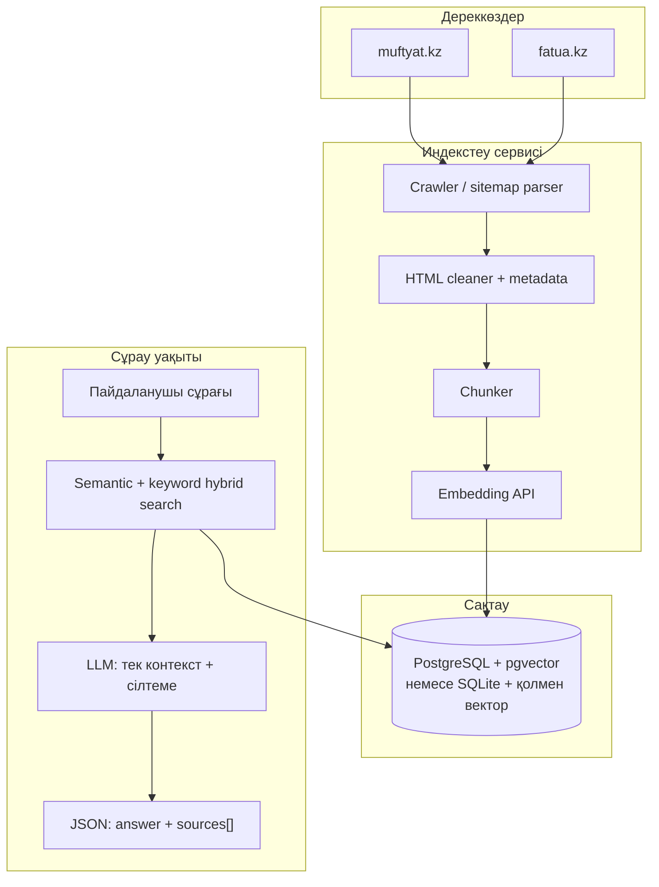

# RAQAT Islamic Knowledge System — Muftyat.kz және Fatua.kz негізінде RAG

Мақсат: сұрақ-жауап **алдымен тексерілген локалды дерекқордан** (сонан кейін семантикалық іздеу) алынып, модель **тек осы контекстке сүйеніп** жауап берсін; әр жауапта **дереккөз сілтемелері** болсын. Бұл құжат RAQAT репозиториясының нақты модульдерімен сәйкестендірілген.

---

## 1. Құқықтық және саясат

### 1а. Рұқсатсыз (әдепкі MVP)

- **«Толығымен көшіру»** (барлық HTML, дизайн, медиа, 1:1 mirror) — авторлық құқық, robots.txt, қызмет көрсету шарттары тұрғысынан тәуекелді; **ұсыныlмайды**.
- **Дұрыс модель:** ресми сайттарды **дереккөз** ретінде көрсету, URL сақтау, **attribution**, мәтінді **chunk**-тармен пайдалану.

### 1б. ҚМДБ ресми рұқсат (2026)

**Fatua.kz + Muftyat.kz** — RAQAT-қа мазмұнды көшіруге **ресми рұқсат берілді**.

| Env | Мағына |
|-----|--------|
| `RAQAT_ISLAMIC_KB_OFFICIAL_LICENSE=1` | Толық индекстеу режимі, `license_note`, кітап URL-дері, ұзын excerpt |
| `python scripts/sync_islamic_kb.py --full` | Sitemap + кітаптар, max ~10k URL |

Толық runbook: [kmdmb-official-content-license-kk.md](operations/kmdmb-official-content-license-kk.md).

**Сақталуы керек:** әр материалда canonical URL + «Материал: Fatua.kz / Muftyat.kz»; визуалды бренд mirror емес.

---

## 2. Қазіргі RAQAT-та не бар (қолдануға дайын)

**Жаңартылған күй (2026-05):** `platform_api/islamic_kb/` — SQLite + FTS5, Fatua/Muftyat ingest скрипттері, `ai_proxy` RAG инъекциясы (`RAQAT_ISLAMIC_KB_ENABLED=1`), API `sources[]` + `GET /api/v1/ai/kb/status`, мобильді «Сұрақ-жауап баптаулары» панелі.


| Компонент | Файл / конфиг | Мазмұны |
|-----------|----------------|---------|
| AI прокси | `platform_api/ai_proxy.py` | Gemini, ішкі retrieval + опциялы Google Search |
| Ішкі контекст | `platform_api/ai_context_retrieval.py` | Құран / хадис / есімдер іздеу |
| «Ресми бет» үзіндісі | `platform_api/ai_qa_sources.py` | `RAQAT_AI_QA_SOURCE_URLS` — үтірмен бөлінген 1–5 HTTPS URL, қысқа TTL кэш, HTML→мәтін |
| Промпт ережелері | `ai_proxy.py` → `_structure_rules_*` | Ойдан аят/хадис қоспау, сақтық, мәзһаб |

**МVP-ге жақын қадам (код өзгертпей):** `.env`-та `RAQAT_AI_QA_SOURCE_URLS` қою — бірақ бұл **бәрі бір сұрауға бірдей үзінді** береді; **сұраққа байланысты** Fatua/Muftyat RAG үшін төмендегі фазалар қажет.

---

## 3. Мақсатты архитектура (RAQAT репоға сәйкес)

Төмендегі диаграмма **mirror емес**, индекстелген мәтін + векторлық іздеу ағынын білдіреді.



**Қайда орналастыру ұсынылады (жаңа папка, мобильдіге тәуелді емес):**

```
platform_api/
  islamic_kb/           # жаңа пакет
    __init__.py
    models.py           # Pydantic: Chunk, SearchHit, RagAnswer
    ingest_fatua.py
    ingest_muftyat.py
    chunking.py
    embed_client.py     # OpenAI / Gemini embeddings
    search_sql.py       # FTS + metadata filter
    search_vector.py    # кейін: pgvector
    rag_assemble.py       # промпт құрастыру + sources
```

Синхрондау скрипттері (cron / GitHub Actions):

```
scripts/
  sync_islamic_kb_fatua.py
  sync_islamic_kb_muftyat.py
  rebuild_islamic_kb_embeddings.py
```

---

## 4. Дерекқор схемасы (PostgreSQL + pgvector — production)

SQLite MVP үшін `embedding` BYTEA орнына JSON массив немесе бөлек `embeddings` файлы қолданылады; production үшін **pgvector** ұсынылады.

```sql
-- Дереккөз жазбасы (бет / мақала / пәтуа карточкасы)
CREATE TABLE islamic_kb_documents (
  id              BIGSERIAL PRIMARY KEY,
  source_site     TEXT NOT NULL,           -- 'muftyat' | 'fatua'
  canonical_url   TEXT NOT NULL UNIQUE,
  title           TEXT,
  published_at    TIMESTAMPTZ,
  category        TEXT,
  language        TEXT DEFAULT 'kk',
  license_note    TEXT,                    -- attribution мәтіні
  raw_fetched_at  TIMESTAMPTZ NOT NULL DEFAULT NOW(),
  content_hash    TEXT NOT NULL            -- қайта-индекстеу үшін
);

-- RAG үшін бөлшектер
CREATE TABLE islamic_kb_chunks (
  id              BIGSERIAL PRIMARY KEY,
  document_id     BIGINT NOT NULL REFERENCES islamic_kb_documents(id) ON DELETE CASCADE,
  chunk_index       INT NOT NULL,
  text_plain        TEXT NOT NULL,
  token_estimate    INT,
  fts_tsv           tsvector GENERATED ALWAYS AS (to_tsvector('simple', text_plain)) STORED
);

CREATE INDEX islamic_kb_chunks_fts ON islamic_kb_chunks USING GIN (fts_tsv);

-- Вектор (pgvector кеңейтімі қосылғаннан кейін)
-- ALTER TABLE islamic_kb_chunks ADD COLUMN embedding vector(1536);
-- CREATE INDEX ON islamic_kb_chunks USING ivfflat (embedding vector_cosine_ops);
```

**MVP іздеу:** тек `tsvector` + `plainto_tsquery` (қазақ морфологиясы үшін кейін `unaccent` / кастом словарь). **2-фаза:** embedding + cosine top-k, содан кейін hybrid (FTS + vector).

---

## 5. Сұрау pipeline (ai_proxy-пен біріктіру)

1. Пайдаланушы `prompt` → `_search_query_from_prompt` сияқты **қысқа сұрау жолы**.
2. `islamic_kb.search(query)` → топ N `chunk` + `canonical_url` + `title`.
3. Егер hit жоқ немесе score төмен → модельге: *«Контекстте жауап жоқ»* режимі (галлюцинацияны шектеу).
4. `_prompt_with_retrieval`-қа қосымша блок: `[Муфтият / Fatua дереккөз үзінділері]` + әр үзіндінің астында URL.
5. **API жауабы кеңейту (келешек):** тек `text` емес, мысалы:

```json
{
  "text": "…қазақша жауап…",
  "sources": [
    { "title": "…", "url": "https://fatua.kz/…", "site": "fatua" },
    { "title": "…", "url": "https://muftyat.kz/…", "site": "muftyat" }
  ],
  "retrieval": { "mode": "fts+vector", "top_score": 0.42 }
}
```

Мобильді / бот **дереккөз карточкаларын** осы `sources` бойынша көрсетеді.

---

## 6. Moderation және қауіпті тақырыптар

- Сұрауды **алдымен** классификациялау (экстремизм, саяси фитна, жеке өш алу) — `platform_api/ai_security.py` үлгісін кеңейту немесе бөлек `islamic_kb/moderation.py`.
- Жауапта: *пәтуа емес*, *ұстазға жүгіну*, *ресми реестр*.
- Логта: user_id, сұрақ hash, қай chunk id пайдаланылды (аудит).

---

## 7. Синхрондау (cron)

| Жиілік | Әрекет |
|--------|--------|
| 6–24 сағ | Sitemap / API арқылы жаңа URL, `content_hash` өзгерген беттерді қайта тарт |
| Күніне 1 | Embedding қайта есептеу (тек өзгерген chunk) |
| Қолмен | `robots.txt` өзгерісі, домен саясаты — скриптті тоқтату |

---

## 8. NPM емес, неге Python

RAQAT ядросы (`platform_api`, `handlers`, `db`) **Python**. Crawler + DB + RAG **бір тілде** ұстау операциялық жеңіл. Node скрипттері тек қосымша болуы мүмкін; міндетті емес.

Python үшін ұсынылатын пакеттер (тізбекке қосу кезінде): `httpx`, `beautifulsoup4` / `selectolax`, `trafilatura` (мәтін тазалау), `croniter` немесе жүйелік cron, `pgvector` (SQLAlchemy арқылы), embeddings үшін OpenAI немесе Google **серверлік** кілт.

---

## 9. Іске асыру кезеңдері (қысқа)

| Кезең | Нәтиже |
|-------|--------|
| **0** | Келісімдер + URL allowlist + `robots.txt` талдау |
| **1** | `islamic_kb_documents` / `chunks` + ingest скрипт + FTS іздеу + `ai_proxy`-ға контекст инъекциясы |
| **2** | Embeddings + pgvector + hybrid search |
| **3** | API `sources[]` + мобильді UI «дереккөздер» |
| **4** | Telegram бот `/fatwa` режимі — сол RAG endpoint |

---

## 10. Келесі нақты кодтау тапсырмалары (Cursor агенті үшін)

1. `db/migrations.py` (немесе қолданыстағы Postgres миграция жолы) — жоғарыдағы кестелер.
2. `scripts/sync_islamic_kb_fatua.py` — бір URL немесе sitemap entry, cleaner, chunk insert.
3. `platform_api/islamic_kb/search.py` — FTS `top_k`.
4. `ai_proxy.generate_ai_reply*` — retrieval қабатында `islamic_kb` шақыру (feature flag: `RAQAT_ISLAMIC_KB_ENABLED=1`).
5. `.env.example` — `RAQAT_ISLAMIC_KB_*`, embedding модель, rate limit.

---

## 11. Қорытынды

Muftyat пен Fatua **RAQAT ішінде authoritative RAG қабаты** ретінде дұрыс интеграцияланады: mirror емес, **сілтемелі**, **үзінділі**, **аудиттелетін** архитектура. Қазіргі кодтағы `ai_qa_sources` ENV жолы — уақытша көпір; нақты өнім үшін жоғарыдағы кесте + сұрауға байланысты іздеу қажет.

Осы құжатты жаңарту: әр фаза аяқталған сайын «Қазіргі күй» бөліміне статус қосыңыз.
