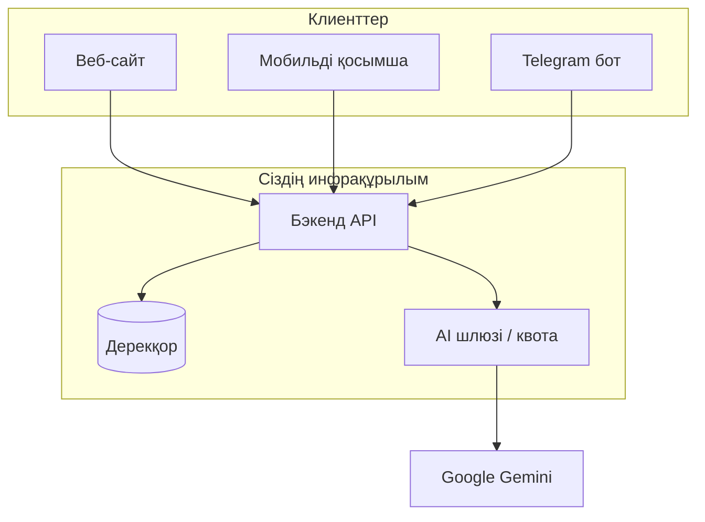

# RAQAT платформасы

**Нұсқаулық** — веб-сайт, мобильді қосымша және Telegram бот бір-бірімен қалай жұмыс істеуі керек; маңызды шешімдер мен реті осы құжатта жинақталған.

---

## Алғы сөз

RAQAT — исламдық контент пен құралдарды біріктіретін өнім. «Кітаптағыдай» деген талап: **бірінші — мағына мен сенімділік**, содан кейін **техника**; пайдаланушыға **түсінікті құрылым** (бөлімдер, қайда басу керегі анық).

---

## Солтүстік жұлдыз: USER · VALUE · UX

**Техника экожүйе емес — пайдаланушы экожүйе жасайды.** Қазіргі кезде **0 user = 0 экожүйе**: сақтық көшірме, API, контент бар да, **өнімділік** нақты адамдардың қайта оралуымен өлшенеді.

### 1) USER (ең басты)

| Кезең | Мақсат | Не дәлелдейді |
|--------|--------|----------------|
| **Proof** | шамамен **100** белсенді пайдаланушы | Идея сатылады: күндіз қайта оралу, бір сценарийді нақты аяқтау |
| **Growth** | **1000+** және тұрақты өсу | Тарату, сақтау (retention), сөз жүзінде ұсыныс |

Метрикаларды (DAU, қайта оралу, бірінші аптаның retention) өнім шешімдерімен байланыстыру керек; техникалық толығырақ: `docs/PLATFORM_ROADMAP_API_AI_USERS.md`, `PLATFORM_GPT_HANDOFF.md`.

### 2) DAILY VALUE — user күнде не үшін кіреді?

Қолда бар: **AI**, **Құран**, **хадис** — бірақ **бірінші экрандағы фокус** мына үш тіректе шоғырлануы керек (қалғаны тереңдік / мәзір):

| Тірек | Неге басты |
|--------|------------|
| **Намаз уақыты** | Күнделікті қайта оралудың табиғи себебі; қаланың баптауы, ескертулер |
| **Күнделікті аят** | Қысқа, аяқталған әрекет: «бүгінгі аят» → оқу / сақтау |
| **Бір AI сұрақ** | Тез жауап, шектеулі контекст — «бір сұраққа бір жауап» форматына жақын |

Хадис пен терең Құран іздеу — **екінші дәреже** (мәзір, іздеу), басты бетті тығыз емес ұстау.

### 3) SIMPLE UX — бір басу → бір нәтиже

- **Принцип:** әр негізгі әрекет **бір түйме** арқылы аяқталатын нәтижеге жеткізеді (қосымша қадамдар азаяды).
- **Қазіргі тәуекел:** функция көп → таңдау шаршатады. Шешім: **басты ағынды** жоғарыдағы үш тіректе шектей отырып, қалғанын мәзірге шығару (XI бөлімдегі қабаттармен үйлеседі).
- Дизайн жобасы: прототиптерде «басты экран = уақыт + бүгінгі аят + AI» схемасын басымдау.

### Техникамен үйлесім (қысқа бриф)

Толық инженерлік мәтін: **`docs/PLATFORM_GPT_HANDOFF.md`**. Мазмұны қысқаша:

| Құрамдас | Мазмұны |
|----------|---------|
| **Hybrid Storage** | `db/get_db.py` — `with get_db() as conn:`; PostgreSQL-да lazy **pool**; `db/dialect_sql.py` — `?` / `%s` және диалект үйлесімі |
| **Identity & Linking** | Telegram `user_id` ↔ UUID (**`platform_identities`**); JWT **`sub`**; **`POST /auth/link/telegram`** — бот, мобильді, API бір профиль |
| **Орталық AI Proxy** | **`/api/v1/ai/*`**; **Gemini** кілті серверде; **`ai`** scope немесе **`X-Raqat-Ai-Secret`** |
| **Инкременттік синхрон** | **`GET /metadata/changes`**, **ETag** / **304**, **`since`** + **`updated_at`** (миграция **005**) |

**Келесі инженерлік қадамдар** (cutover, placeholder audit, толық linking, локальды `dev_restart_platform.sh`): сол құжаттың «Келесі қадамдар» бөлімі және **XII** бөлім осы файлда.

---

## I бөлім. Негізгі мақсат

1. **Веб-сайт** — орталық бет, түсіндіру, жүктеу сілтемелері, кейін: аккаунт, төлем, қолдау.
2. **Мобильді қосымша** — офлайнға жақын сценарийлер (уақыт, құбыла, Құран мәтіні), веб пен ботпен **сәйкес бренд**.
3. **Telegram бот** — тез қол жеткізу, дауыс, AI, хадис/Құран тереңдігі; вебпен **сілтеме арқылы** байланысады.

Барлығының астында **бір саясат**: дерек дұрыстығы, AI шектеулері, шот.

---

## II бөлім. Архитектура (қысқа сурет)

Келешекте мақсатты күй: клиенттерде **Gemini API кілті болмауы**; сұраулар **сіздің серверіңіз** арқылы өтеді.

**Қазіргі күй (өткел):** ботта Gemini тікелей шақырылады — платформа өскенде API **прокси**ға көшіріледі.

---

## III бөлім. Веб, қолданба, бот — рөлдер

| Канал | Негізгі міндет |
|--------|----------------|
| **Веб** | Таныстыру, сенім, сілтемелер (`t.me/...`, App Store), кейін аккаунт және төлем |
| **Қолданба** | Күнделікті: намаз, құбыла, Құран; вебтегі жаңалықтарға сілтеме |
| **Бот** | Жылдам AI, хадис, дауыс; вебке «Толығырақ» қайтару |

**Бірдей дерек:** хадис/Құран мәтіндері бір көзден (мысалы `global_clean.db` немесе API арқылы синхрон).

---

## IV бөлім. Деректер мен хадис

- Кесте: `hadith`, `quran`, пайдаланушы баптаулары.
- **Қазақша аударма** (`text_kk`) толықтығы бот пен қолданба көрсетуіне әсер етеді; толтыру **батч скрипттер** + кейін API арқылы бақылау.
- Іздеу индексі (`hadith_fts`) өзгерістен кейін **қайта құру** керек екенін есте сақтаңыз.

---

## V бөлім. Жасанды интеллект және шот

1. **Бір Google проект** — billing, квота, ескертулер бір жерде.
2. **Бюджет және алерт** — Cloud Console / AI Studio.
3. **Rate limit** — ботта пайдаланушы аралығы бар; платформада **аккаунттық** лимит қосыңыз.
4. **Модель таңдауы** — `flash-lite` сияқты арзанырақ жолды алдымен пайдалану; ауыр батч — түнде, `limit`пен.

---

## VI бөлім. Қауіпсіздік

- `.env` — репозиторийге **емес**; production’да құпиялық менеджер.
- Ботта **бір процесс** (`systemd`), қолмен екінші `bot_main` іске қоспау.
- Діни мәтін: AI жауабы **фиқһтық үкім емес**, ақпараттық көмек ретінде көрсетілуі — вебте де, ботта да **қысқа disclaimer** орынды.

---

## VII бөлім. Іске асыру реті (қадамдар)

1. Веб: статикалық бет + бот және қолданба сілтемелері.
2. Кішкене API: денсаулық (`/health`), кейін оқу-only endpoint-тер (Құран/хадис).
3. Ботты кезең-кезеңімен API арқылы AI-ға қосу (немесе алдымен тек жаңа веб-функциялар API-да).
4. Қолданба: **`EXPO_PUBLIC_RAQAT_API_BASE`** немесе `app.json` → `expo.extra.raqatApiBase` (тексеру: **Баптаулар** экраны); auth керек болса — вебпен бір протокол.

---

## VIII бөлім. Сыртқы сілтемелер

- Telegram Bot API: https://core.telegram.org/bots/api  
- Gemini API: https://ai.google.dev/gemini-api/docs  

---

## IX бөлім. Репозиторийдегі бастапқы қалталар (MVP)

| Қалта | Мазмұны |
|--------|---------|
| `web/` | Статикалық басты бет (`index.html`, `styles.css`). Жергілікті: `cd web && python3 -m http.server 8080` |
| `platform_api/` | FastAPI: `GET /health`, `GET /api/v1/info`, `GET /api/v1/stats/content`. Іске қосу: `scripts/run_platform_api.sh` · `platform_api/README.md` |
| `docs/RAQAT_PLATFORM.md` | Осы нұсқаулық |
| `mobile/` | Expo қолданба; платформа API мекенжайы: `EXPO_PUBLIC_RAQAT_API_BASE` / `app.json` → `extra.raqatApiBase` — **Баптаулар** экранында тексеру. Толығырақ: `mobile/README.md` |

Веб беттегі бот сілтемесі қолданбадағы `@my_islamic_ai_bot` мекенжайымен үйлесімді.

---

## X бөлім. Келесі фаза — орталық API, AI, пайдаланушы

Мақсатты үш бағыт (қысқаша):

1. **AI орталықта:** `Bot → Platform API → AI` (қазір ботта Gemini тікелей).
2. **API — ядро:** mobile, web, bot бір HTTP API арқылы дерек пен AI-ға қол жеткізеді.
3. **User system:** login, profile, history (JWT/OAuth, кестелер, бот `user_id` байланысы).

Толық жоспар, кезеңдер, mermaid: **`docs/PLATFORM_ROADMAP_API_AI_USERS.md`**.  
API-да карказ endpointтер: `platform_api/roadmap_routes.py` (501/401, OpenAPI-да көрінеді).

---

## XI бөлім. Өнім қабаттары (жол картасы)

Мақсат: **пайдаланушы қай клиенттен кірсе де — бір жүйе** (бір аккаунт, бір тарих, бір контент саясаты). Төменде — стратегиялық қабаттар; техникалық деталь `PLATFORM_GPT_HANDOFF.md`, auth/API — `PLATFORM_ROADMAP_API_AI_USERS.md`.

### 1. Client layer (клиенттер)

| Қазір | Қосу |
|--------|------|
| Telegram бот | **Mobile** (Expo → кейін native), **web app** — веб кеңейту, қолданбада офлайнқа жақын сценарийлер |

### 2. Content layer (контент)

| Қазір | Қосу |
|--------|------|
| Құран, хадис | **Намаз толық гид** (дәреттен бастап), **ислам курстары**, **фатуа базасы** (мазмұнды саралау, шектеу және заңнама/ұстаз кеңесі ескертуі), **аудио / видео** |

Бұл қабат — **retention** үшін негіз: пайдаланушыны ұстап тұратын мазмұн.

### 3. AI layer (артықшылық)

| Қазір | Күшейту |
|--------|---------|
| AI чат, halal сурет | **Islamic AI** (topic classifier, тәфсір/контекст шегі), **дауысты көмекші**, **жекелендірілген жауаптар** (тарих/профильмен үйлесімді) |

Бұл RAQAT-ты бәсекелестерден **ерекшелендіретін** қабат.

### 4. Social / user layer (аккаунт пен әлеумет)

| Қазір | Қосу |
|--------|------|
| Платформа аккаунты / JWT, тарих (`platform_identities`, чат) кестелері | **Profile**, **bookmarks**, **streak** (күнделікті қолдану), **community** (кейінгі фаза) |

Мақсат — **удержание (retention)** және қайта оралу.

### 5. Money / halal finance layer (монетизация)

| Қосу (басымдық реті жоба шешімімен) |
|--------------------------------------|
| **Subscription** (AI, premium мазмұн) |
| **Төлемді halal тексеру** (сурет/модель квотасы) |
| **Донат / садақа** арнасы |
| **Marketplace** (кейін; халал тауар/қызмет ережелерімен) |

Экожүйе үшін тұрақты модель; фиқһтық және заңдық кеңес алу ұсынылады.

---

## XII бөлім. Платформаны «мықты дәрежеге» — техникалық басымдықтар (орындау реті)

Бұл тізім **бір түнде емес**, сапалы итерациялармен жүзеге асырылады. Дерек пен қызметтің **тұрақтылығы** алдымен, содан кейін **клиенттер мен монетизация**.

### Деңгей A — сенімділік (алдымен)

| Іс | Неге |
|----|------|
| **Түнгі/тәуліктік сақтық көшірме** | `bash scripts/backup_sqlite.sh` — SQLite файлы; PostgreSQL болса `pg_dump` + § `MIGRATION_SQLITE_TO_POSTGRES.md`. |
| **Healthcheck** | `bash scripts/healthcheck_raqat.sh` — API `/ready` (дерекқор), резерв `/health`, бот процесі; cron. |
| **Cutover дайындығы** | `DATABASE_URL`, миграциялар, `docs/MIGRATION_SQLITE_TO_POSTGRES.md` §15. |
| **Бот ↔ API JWT** | `.env`-те `RAQAT_PLATFORM_API_BASE` + `RAQAT_BOT_LINK_SECRET` — `/start` link (`PLATFORM_GPT_HANDOFF.md`). |

### Деңгей B — бір дерек, бір API (қолданушы тәжірибесі)

| Іс | Неге |
|----|------|
| **Mobile Құран** | `EXPO_PUBLIC_RAQAT_API_BASE` орнатылғанда: `fetchPlatformQuranSurah` / `fetchQuranSurahs` — бір дерек; қазақша `text_kk` екінші жол; сәтсіздікке `api.alquran.cloud` резерві. `contentSync` инкременті араб + `textKk` үйлесімді. |
| **Профиль · bookmark · streak** | JWT + кестелер; `PLATFORM_ROADMAP_API_AI_USERS.md`. |
| **Ескертулер (азан, тәһажжуд)** | Push / Telegram scheduler — жеке таймер жобасы. |

### Деңгей C — AI және кіріс

| Іс | Неге |
|----|------|
| **AI topic / тәфсір шегі** | Пайдаланушыға сенімділік; квота және rate limit. |
| **Subscription, halal premium, донат** | § XI Money layer; төлем интеграциясы. |

**Скрипттер:** `scripts/healthcheck_raqat.sh`, `scripts/backup_sqlite.sh`, `scripts/nightly_maintenance.sh` (екеуін де `.logs/nightly_maintenance.log` жазады). **Қайта іске қосу:** `scripts/dev_restart_platform.sh`.

---

*Соңғы жаңарту: құжат жоба ішінде сақталады; шешім өзгерген сайын тарауларды қысқаша жаңартыңыз.*
