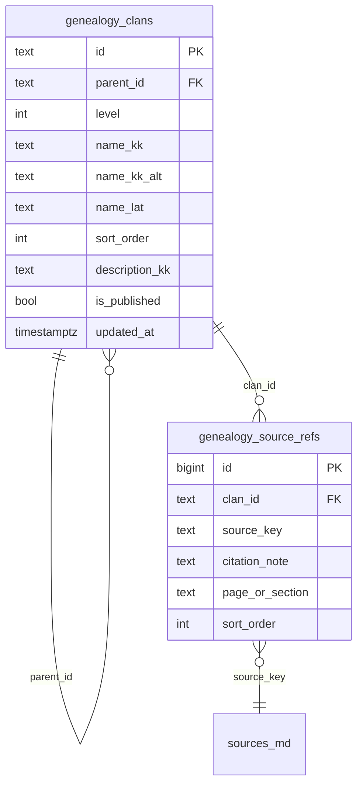

# Genealogy Schema — қазақ шежіресі (GENEALOGY-P0)

**Күй:** Execution Phase · Day 1 (DDL freeze)  
**Модуль:** «Дін мен дәстүр» → `KazakhTraditionScreen` ішіндегі **Шежіре** блок  
**Sprint:** [genealogy-sprint-p0.md](roadmap/genealogy-sprint-p0.md)

---

## 1. Миссия

Генеалогия RAQAT-та әлеуметтік желі емес — **Structured Cultural Knowledge Infrastructure**:

- иерархиялық, дереккөзбен расталған ру ағашы;
- AI Grounding-ке дайын citation модель;
- мобильде **FlatList + Accordion** (60 FPS, төмен деңгейлі Android).

---

## 2. Дерек моделі



### `genealogy_clans`

| Өріс | Тип | Сипаттама |
|------|-----|-----------|
| `id` | `TEXT` PK | Stable slug: `uly_zhuz`, `dulat`, `karakesek` |
| `parent_id` | `TEXT` NULL FK | Жүздерде `NULL`; level 2 → level 1; level 3 → level 2 |
| `level` | `INT` | **1** = жүз, **2** = ру, **3** = тармақ (P0 max) |
| `name_kk` | `TEXT` | Көрсетілетін атау (kk) |
| `name_kk_alt` | `TEXT` | Балама жазылу (Шәкәрім/Мәшһүр варианттары) |
| `name_lat` | `TEXT` | Латиница (іздеу/normalize) |
| `sort_order` | `INT` | UI тәртібі |
| `description_kk` | `TEXT` | Қысқа анықтама (optional) |
| `is_published` | `BOOL` | `0` — draft/review |
| `created_at` / `updated_at` | timestamp | upsert уақыт белгісі |

**Индекстер:** `(parent_id, sort_order)`, `(level, sort_order)`

### `genealogy_source_refs`

| Өріс | Сипаттама |
|------|-----------|
| `source_key` | [`sources/genealogy_sources.md`](../sources/genealogy_sources.md) кілті |
| `page_or_section` | Бет/тарау (optional) |
| `citation_note` | Қысқа ескертпе |

**UNIQUE:** `(clan_id, source_key)`

---

## 3. Дереккөз иерархиясы (AI Grounding)

```
P0 (AI-ға рұқсат): mashhur_jusip_shezhire, shakarim_shezhire, nas_ethnography_kz
P2 (UI-only):      wikipedia_kk_zhuz
```

Әр жарияланған ру **кем дегенде бір P0** `source_key`-ке байLANады.  
Келешекте `/api/v1/genealogy/clans/{id}` жауабында `sources[]` массиві қайтарылады.

---

## 4. P0 catalog (36 node)

Day 2 upsert: `scripts/seed_genealogy_p0.py` · offline: `scripts/export_genealogy_bundled.py` · A1: `scripts/seed_genealogy_a1.py`

```
Ұлы жүз (uly_zhuz, L1)
├── Үйсін (uisin, L2)
│   └── Дулат (dulat, L3)
│       ├── Ботбай (botbay, L4)
│       ├── Тобықты (tobyqty, L4)
│       ├── Желібі (zhelibu, L4)
│       └── Шоланға (sholanga, L4)
├── Албан (alban, L2)
│   ├── Сарыжас (saryzhas, L3)
│   ├── Тана (tana, L3)
│   └── Қарауыл (karauyl, L3)
├── Сарыүйсін (sary_uisin, L2)
├── Суан (suan, L2)
├── Жалайыр (jalayir, L2)
├── Шапырашты (shapyrashty, L2)
├── Ысты (ysty, L2)
└── Ошақты (oshakty, L2)

Орта жүз (orta_zhuz, L1)
├── Арғын (argyn, L2)
│   ├── Қаракесек (karakesek, L3)
│   ├── Қуандық (kuandyk, L3)
│   └── Төртуыл (tortuyl, L3)
├── Найман (nayman, L2)
│   ├── Садыр (sadyr, L3)
│   ├── Бура (bura, L3)
│   └── Керкей (karke, L3)
├── Қоңырат (kongrat, L2)
├── Керей (kerey, L2)
├── Уақ (uak, L2)
└── Қыпшақ (qypshaq, L2)

Кіші жүз (kishi_zhuz, L1)
├── Алшын (alshyn, L2)
│   ├── Әлімұлы (alimuly, L3)
│   └── Байұлы (baiuly, L3)
├── Табын (tabyn, L2)
└── Шекте (shekty, L2)
```

> Дереккөздер: Mashhur Jusip, Шәкәрім, NAS ethnography — әр руға `genealogy_source_refs`.

---

## 5. Upsert семантикасы (Day 2)

```sql
-- idempotent; parent алдымен sort_order бойынша
INSERT INTO genealogy_clans (...) VALUES (...)
ON CONFLICT (id) DO UPDATE SET
  parent_id = EXCLUDED.parent_id,
  level = EXCLUDED.level,
  name_kk = EXCLUDED.name_kk,
  sort_order = EXCLUDED.sort_order,
  updated_at = NOW();
```

Код: `db/genealogy_seed.py` → `upsert_genealogy_p0_clans()`

---

## 6. API (Day 3–4, draft)

| Method | Path | Сипаттама |
|--------|------|-----------|
| `GET` | `/api/v1/genealogy/clans` | `?parent_id=` — бір деңгей children |
| `GET` | `/api/v1/genealogy/clans/{id}` | detail + `sources[]` + `path[]` (breadcrumbs) |
| `GET` | `/api/v1/genealogy/clans/{id}/ancestors` | root → node path |

Auth: **public read** (published only). Write: admin-only (келесі sprint).

---

## 7. Mobile UI — FlatList Accordion

**Экран:** `GenealogyClansScreen` (MoreStack / KazakhTradition entry)

| Компонент | Технология | Себебі |
|-----------|------------|--------|
| Тізім | `FlatList` | Virtualization — 1000+ node scale |
| Accordion | `LayoutAnimation` + local `expandedId` | Nested scroll жоқ |
| Breadcrumbs | `View` + horizontal `ScrollView` | `path[]` API-дан |
| Card row | `Pressable` + chevron | level badge (Жүз/Ру/Тармақ) |

**Navigation state:**

```
stack: [uly_zhuz] → [uly_zhuz, uisin] → [uly_zhuz, uisin, dulat]
FlatList data: children of stack.last()
```

**Offline P0:** bundled JSON snapshot (`mobile/assets/bundled/genealogy-p0.json`) — API fail fallback.

---

## 8. Код картасы (Day 1)

| Файл | Мақсаты |
|------|---------|
| `db/genealogy_schema.py` | DDL SQLite + PostgreSQL |
| `db/genealogy_seed.py` | P0 upsert + source refs |
| `db/migrations.py` v**20** | `genealogy_clans_schema` |
| `sources/genealogy_sources.md` | Citation registry |
| `scripts/seed_genealogy_p0.py` | Day 2 CLI seed |

---

## 9. Миграция орнату

```powershell
# SQLite (local / bot)
python -c "from db.migrations import run_schema_migrations; run_schema_migrations('global_clean.db')"

# Day 2 seed
python scripts/seed_genealogy_p0.py --db global_clean.db
```

PostgreSQL: `ensure_genealogy_tables(conn)` — platform_api startup PG path-та да шақырылады (келесі PR).

---

## 10. Freeze gate (P0)

- [x] Day 1: schema doc + migration v20
- [x] Day 2: seed upsert 26 nodes + source refs
- [ ] Day 3: API read endpoints
- [ ] Day 4: Mobile FlatList accordion screen
- [ ] Day 5–7: QA + AI grounding whitelist hook

[← roadmap/genealogy-sprint-p0.md](roadmap/genealogy-sprint-p0.md) · [sources/genealogy_sources.md](../sources/genealogy_sources.md)
