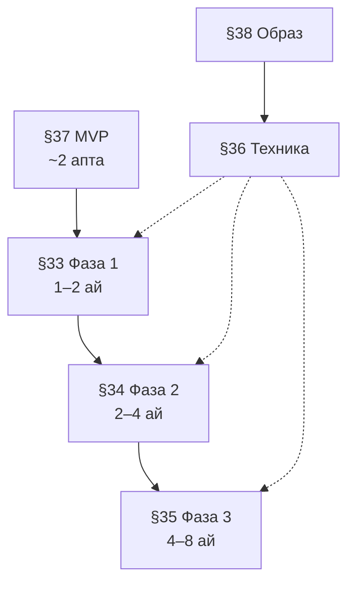

# Тақырып бойынша сілтеме картасы

> Архивтен көшірілді (кезең 3). **Жаңа сессия:** [gpt-sre-summary.md](gpt-sre-summary.md) · [README.md](../README.md). Толық снапшот: [archive §24](../archive/PLATFORM_GPT_HANDOFF_2026-05.md). §33–§38 → [roadmap/phases-index.md](../roadmap/phases-index.md).

---

## 24. Жинақ картасы — тақырып бойынша барлық негізгі сілтемелер (2026)

Бұл бөлім **бір кестеде** жинақтайды: қай сұраққа қай құжат немесе жол; GPT / SRE / жаңа әзірлеуші **§24**-ті скринхоттап немесе көшіріп алса, репо бойынша навигация жасай алады. **Өнім жол картасы (§33–§38)** үшін алдымен **§24.0** қараңыз.

### 24.0 Өнім жол картасы — индекс (§33–§38)

Бұл кесте **фазаларды бір жерден** көру үшін: толық мәтін файлда **§31** бөлімінен кейін **§33** басталады (іздеу: `## 33.`).

| § | Атауы | Мерзім / түрі | Негізгі мазмұн |
|---|--------|---------------|----------------|
| **§33** | Фаза 1: Core Polish | 1–2 ай | Мұсаф, хатым, last read + streaks, намаз/құбыла, UI polish; **§29** спринттерімен сәйкес (**§33.6**) |
| **§34** | Фаза 2: All-in-One Retention | 2–4 ай | Dashboard хаб, тәсбих, Halal+, AI контекст, community lite |
| **§35** | Фаза 3: Advanced + Scale | 4–8 ай | AI терең, gamification, offline-first, PWA+Telegram, monetization |
| **§36** | Техникалық ұсыныстар | қосалқы | Mobile (**§31**), backend (PG/Redis/Celery), data, privacy, performance |
| **§37** | MVP boost | ~2 апта | Шұғыл 5 тапсырма; **§33**-пен **қатар** жүргізуге болады |
| **§38** | Болашақ позициялау | тұрақты | RAQAT образы; **§36** тірегі, **§37** + **§33** алғашқы қадам; **§1** адам ұстанымымен үйлесім |

**Ағымдық байланыс (логикалық):** §37 шұғыл пакеті §33 ядросына сіңеді; §33 → §34 → §35 реті ұзақ мерзімді өнім жолы; §36 барлық фазаларға инженерлік тірек; §38 стратегиялық нүкте.

### 24.0.1 Жергілікті тексеру және CI

**PowerShell (Windows):** `cmd` стиліндегі `&&` / `cd /d` **жұмыс істемейді** — бір каталогта `Set-Location` + нүктелі үтір (`;`) қолданыңыз.

| Орта | Команда мысалы |
|------|----------------|
| **Mobile** | `Set-Location d:\opt\raqat-ai\mobile; npm run lint; npx jest --ci` |
| **Python** | `Set-Location d:\opt\raqat-ai; .\.venv\Scripts\python.exe -m pytest tests -q` |
| **Бірге** | `npm run test:full` тек `mobile/` ішінен (**`package.json`**) |

**GitHub Actions:** `.github/workflows/refactor-smoke.yml` — PR / `workflow_dispatch`: `py_compile` (бот + `platform_api`), нысаналы **`pytest tests/test_platform_api.py -k ...`**, содан **`api-content-smoke`** (SQLite / PostgreSQL матрицасы, uvicorn + `validate_content_release.py`, `/metrics` p95 тексеруі). `.github/workflows/content-release-smoke.yml` — күн сайынғы cron + қолмен іске қосу; контент шығарылымына арналған smoke. Толығы workflow файлдарында.

### 24.1 Өнім және стратегия

| Сұрақ | Қайда |
|--------|--------|
| Барлық фазалар **бір кестеде** (шолу) | **§24.0** |
| Солтүстік жұлдыз, USER/VALUE/UX, XI–XII | `docs/RAQAT_PLATFORM.md` |
| Экожүйе карта, Docker, build order | `ECOSYSTEM.md`, `docs/PRODUCTION_BLUEPRINT_2M_USERS.md`, `infra/docker/docker-compose.yml` |
| Бәсекелес қолданбалардың ең күшті жақтары (RAQAT-қа идея ретінде) | **§1.0** |
| **Адамға жеңіл · оңай · керек** өнім ұстанымы | **§1** (кіріспе абзац), **§38** (позициялау) |
| Жол картасы: Фаза 1–3, техника, 2 апта MVP, позициялау (детальды мәтін) | **§24.0** (индекс + диаграмма), содан **§33**–**§38** |

### 24.2 Дерекқор және көшу

| Сұрақ | Қайда |
|--------|--------|
| SQLite → PostgreSQL, DSN, пул, placeholder | `docs/MIGRATION_SQLITE_TO_POSTGRES.md`, `db/get_db.py`, `db/dialect_sql.py` |
| Өндірісте SQLite емес | **`docs/PRODUCTION_POSTURE.md` §1**, `OPERATIONS_STACK_CHECKLIST.md` §2 |
| Alembic, PG DDL мысалдары | `docs/ALEMBIC_BOOTSTRAP.md` |
| SQLite миграция 012–014, bootstrap login | **§23**, `db/migrations.py` |

### 24.3 Redis, Celery, AI, бақылау

| Сұрақ | Қайда |
|--------|--------|
| Redis міндетті / тест `REQUIRED=0` | **`PRODUCTION_POSTURE.md` §2**, `tests/conftest.py` |
| Кезек, retry, timeout, DLQ жол картасы | **`PRODUCTION_POSTURE.md` §5**, `platform_api/celery_app.py`, `celery_tasks.py` |
| Орнату тізбегі | `OPERATIONS_STACK_CHECKLIST.md`, `scripts/ops_stack_checklist.sh` |
| `/metrics`, Prometheus, Grafana идеясы | **`PRODUCTION_POSTURE.md` §3**, `OPERATIONS_STACK_CHECKLIST.md` §5 |
| Exact + семантикалық AI кэш | **`PRODUCTION_POSTURE.md` §4**, `ai_exact_cache.py`, `ai_semantic_cache.py`, `RAQAT_AI_SEMANTIC_CACHE` |

### 24.4 Auth, JWT, Telegram link

| Сұрақ | Қайда |
|--------|--------|
| `/auth/login`, `/auth/link/telegram`, uuid `sub` | **§5.4**, **§23**, `platform_api/auth_routes.py`, `jwt_auth.py` |
| Тесттер | `tests/test_auth_link.py`, **§11** |

### 24.5 Құран / хадис мазмұны

| Сұрақ | Қайда |
|--------|--------|
| Құран импорт, транслит | `docs/QURAN_GPT_HANDOFF.md` |
| Хадис `source`, KK аударма, редакция | `docs/HADITH_DATA_PROVENANCE.md` (§9 редакция), `data/hadith_kk_glossary.md`, `data/hadith_kk_editorial_batches.md` |
| Ислам білім базасы / RAG (платформа + мобильді контекст) | **`docs/RAQAT_ISLAMIC_KNOWLEDGE_RAG.md`**; нақты модуль + env — **§42.5** (байланысы: **§39.6** дәстүр экраны) |

### 24.6 Мобильді (Expo)

| Сұрақ | Қайда |
|--------|--------|
| Jest + lint сандары (соңғы бекіту) | **§11** (және **§25.5** `mobile/` кестесі); **AsyncStorage mock** — **§39.1** |
| API base, құпиялар | `mobile/src/config/raqatApiBase.ts`, `app.config.js`, [mobile/handoff-api-client.md](../mobile/handoff-api-client.md) |
| 99 есім UI (басты промо + экран) | `DashboardScreen.tsx` (промо), `AsmaAlHusnaScreen.tsx`; таб ортасы жоқ |
| Баптаулар, логин, донат URL | `SettingsScreen.tsx`, `raqatDonationUrl.ts`, `app.json` extra |
| Офлайн Құран, UI defer | **§22.3**, `utils/uiDefer.ts` |
| Хатым кітап UI, Құран мұсаф, аудио скролл, last read, RNGH, компонент бөлу | **§26**, **§26.7**, **§26.8**, **§32** (сызықты мұсаф, джуз, шапка, ассеттер), `HatimScreen.tsx`, `MoreStack.tsx`, `QuranSurahScreen.tsx`, `QuranListScreen.tsx`, `SettingsScreen.tsx`, `DashboardScreen.tsx`, `mobile/src/storage/quranLastRead.ts`, `mobile/src/storage/quranReaderPrefs.ts`, `mobile/src/config/mushafConfig.ts`, `mobile/src/config/quranArabicFontPresets.ts`, `mobile/src/quran/mushafTypography.ts`, `mobile/src/quran/useMushafStyles.ts`, `mobile/src/quran/mushafAyahArabicLineHeight.ts`, `mobile/src/components/quran/MushafAyah.tsx`, `mobile/src/components/quran/AyahContextMenuSheet.tsx`, `mobile/src/components/quran/MushafAyahRow.tsx`, `mobile/src/components/KazakhOrnamentBand.tsx`, `App.tsx`, `expo-screen-orientation`, `react-native-gesture-handler` |
| Мұсаф бет нөмірі (Хафс 604), жергілікті PageList | **§30.2**, **§32.1** (prefs жоқ; тек `mushafDisplayPageFromGlobalAyahOneBased`), `quranMushafPageByGlobalAyah.ts`, `quranHafsPageFromGlobalAyah.ts`, `quranHafsPageStarts.generated.json`, `quranHizbBoundaries.ts` |
| Мұсаф келесі sprint (Polish, audio, FlashList интеграциясы) | **§29** (1- және 2-спринт deliverables), FlashList нұсқасы — **§30.3** |
| Өнім жол картасы (фазалар 1–3, MVP 2 апта, техника, образ) | **§24.0** (индекс), толық мәтін **§33**–**§38**; ядро мобильді жинақ — **§26**–**§32** + **§29**; **2026-05-13 — 2026-05-15** — **§39** (**§39.6–39.8**); **2026-05-16** — **§42** (Құрбан айт, құбыла иін, шапка, ислам KB) |
| Құрбан айт нұсқаулығы, басты бет карточкасы, тақырыптар панелі | **§42.1** — `KurbanAitScreen`, `KurbanAitTopicsPanel`, `DashboardKurbanAitCard`, `kurbanAitGuideContent.ts` |
| Құбыла оюлы PNG иін, бұру геометриясы | **§42.2**, **§25.3** жаңарту — `qiblaArrowGeometry.ts`, `QiblaArrowPointer` `ornamentArrow` |
| Басты бет шапкасы (RAQAT оңға, баптаулар жиегі) | **§42.3** (§32.5 ескірген схема) |
| Мұсаф бет `#EFEFEF` | **§42.4** |
| Ислам KB RAG (`platform_api/islamic_kb`, API, мобильді sources) | **§42.5**, `docs/RAQAT_ISLAMIC_KNOWLEDGE_RAG.md` |
| Android намаз home screen виджеттері, debug APK жолы | **§39.2**, **§39.1**, **§32.7** |
| «Дін мен дәстүр» экран құрылымы (кітаптар жоғарыда), Expo web JPEG/PNG ассет қатесі, AppState `inactive` | **§39.6**, **§39.7**, **§39.8** |
| `platform_api` сыртқа HTTPS (VPS, tunnel) | **`docs/VPS_PRODUCTION_PLATFORM_API.md`** (**§39.4**), **`docs/PRODUCTION_POSTURE.md`** |
| PostgreSQL cutover тәуекелі, SQLite шегі, async/Alembic/repository/RW абстракция | **§27.1**, **§40.1** |
| `QuranSurahScreen` техника қарызы, hook-декомпозиция (useQuranReader, т.б.) | **§40.2**, **§31** |
| AsyncStorage шоғырлануы, MMKV / Zustand persist / жергілікті SQLite | **§40.3** |
| **P0 / P1 / P2 басымдық матрицасы** (Backend, Mobile, Product) | **§41** |
| Mobile `src/` рефактор: features/quran, zustand, спринт тізбегі | **§31** (ұсыныс; кодта әлі міндетті түрде іске аспаған) |

### 24.7 Runbook және ops біріктірілген

| Сұрақ | Қайда |
|--------|--------|
| 5 track: PG + JWT + Redis + mobile + app.main | `docs/OPERATIONS_RUNBOOK_5_TRACKS.md` |
| Локальды тексеру | `docs/DEV_LOCAL_CHECKLIST.md` |
| Python `pytest` (`tests/`) | **§11**, түбірде `pytest tests` (жергілікті: **§25.5** кестесімен сәйкес сандар) |
| GitHub Actions (PR smoke, контент smoke) | **§24.0.1**, `.github/workflows/refactor-smoke.yml`, `content-release-smoke.yml` |

### 24.8 Жинақты модельге қалай жіберу

1. [gpt-sre-summary.md](gpt-sre-summary.md) + `PRODUCTION_POSTURE.md` (немесе осы §24 картасы / [archive](../archive/PLATFORM_GPT_HANDOFF_2026-05.md)). **Жол картасы:** [roadmap/phases-index.md](../roadmap/phases-index.md), **§24.0**.  
2. Нақты тапсырма: мысалы «PG cutover», «хадис батч B-01», «мобильді донат URL» — **§24.1–24.7** кестесінен жол таңдау; **басымдық тәртібі** — **§41**; **өнім жолы (барлық фазалар)** — алдымен **§24.0**, содан **§33**–**§38**; **бәсекелес UX идеялары** — **§1.0**; **мұсаф sprint** — **§29**; **Хафс 604 JSON / PageList** — **§30.2**; **мұсаф UI + хатым джуз + басты бет (соңғы)** — **§32**; **Jest / виджет / VPS API құжаты / Halal / дәстүр экраны / web asset / AppState** — **§39** (тіпті мәлімет **§39.6–39.8**); **Құрбан айт / құбыла иін / шапка / ислам KB** — **§42**; **PG алдындағы платформа қабаты + QuranSurahScreen hook-тар + AsyncStorage траекториясы** — **§40**; **mobile/src Feature-Sliced көшіру** — **§31**.  
3. Терең мәтін қажет болса: кестедегі файлды толық оқу.  
4. **Жергілікті / Windows / CI:** **§24.0.1**.  
5. **Өнім принципі (адамға жеңіл · оңай · керек):** **§1**, **§38**.  
6. **Соңғы мобильді + RAG (2026-05-16):** **§42**.

---
