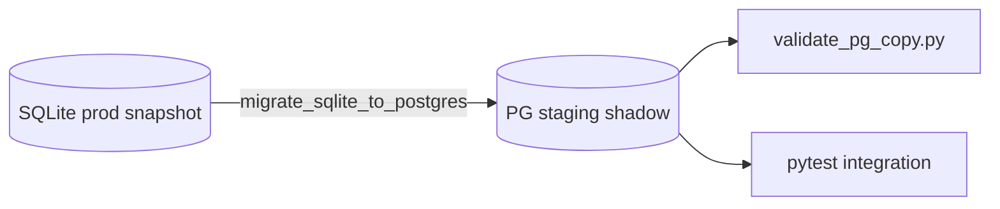

# Sprint 1 — Architecture Deep Dive v2 (Failure Modes & Rollback)

**Күй:** LOCKED (Sprint 1 defensive architecture)  
**Milestone:** M1 Data Layer Lock → Day 5  
**Байланыс:** [sprint-1-project-board.md](../roadmap/sprint-1-project-board.md) · [sprint-1-github-issues-101-103.md](sprint-1-github-issues-101-103.md)  
**Репо runbook:** [MIGRATION_SQLITE_TO_POSTGRES.md](../MIGRATION_SQLITE_TO_POSTGRES.md) · [OPERATIONS_RUNBOOK_5_TRACKS.md](../OPERATIONS_RUNBOOK_5_TRACKS.md) §1

---

## 1. Неге Deep Dive v2 (Sprint 1)

| Тәуекел | Impact | Sprint 1 mitigation міндетті |
|---------|--------|------------------------------|
| PostgreSQL cutover | **Critical** — downtime, дерек жоғалуы | Shadow DB + backup + rollback runbook |
| AI KB-Only leak | **Critical** — compliance / діни қауіпсіздік | Middleware + negative tests + env gate |
| Last read loss | **High** — UX regression | Local WAL + remote sync (M2) |
| Async pool / deadlock | **High** — API 503 | Pool tuning + timeout + circuit breaker |
| Redis stale cache | **Medium** | TTL + write invalidation |

---

## 2. Critical Failure Modes & Mitigation

| ID | Тәуекел | Сипаттамасы | P | Impact | Mitigation (Sprint 1) | Owner track |
|----|---------|-------------|---|--------|----------------------|-------------|
| FM-01 | **DB migration failure** | COPY/DDL қате, row count mismatch, advisory lock conflict | High | Critical | Pre-migration backup; `--validate-only`; `validate_pg_copy.py`; rollback §4 | #101–103 |
| FM-02 | **Cutover split-brain** | SQLite + PG параллель жазу сәйкессіз | Medium | Critical | **Read-only window + delta migrate** (әдепкі); dual-write — тек staging | #103 |
| FM-03 | **Connection pool exhaustion** | `RAQAT_PG_USE_POOL` / max overflow | Medium | High | `RAQAT_PG_POOL_MIN/MAX`; query timeout; `/ready` 503 алдında alert | #102 |
| FM-04 | **Async deadlock / long txn** | Uvicorn + sync psycopg блок | Medium | High | Қысқа транзакция; `get_db()` scope; slow query runbook | #102 |
| FM-05 | **Last read persistence loss** | App crash / background kill | High | High | `useLastReadPersistence` + AsyncStorage; M2 server sync | #104 |
| FM-06 | **AI hallucination leak** | KB-Only сүзгісі өтпей қалу | Medium | Critical | `RAQAT_AI_KB_ONLY=1`; `tests/test_ai_kb_only_mode.py`; negative prompts | #105 |
| FM-07 | **Redis cache inconsistency** | Stale AI exact cache | Medium | Medium | TTL; tag invalidation on write (`db/genealogy/cache_manager.py` үлгісі) | #102 |
| FM-08 | **Rollback delay** | KPI анық емес → geç rollback | Medium | Critical | §3 KPI — **бір primary metric** | #103 |

---

## 3. Rollback KPI (бекітілген — FM-08 шешімі)

**Primary rollback trigger (production cutover кейін 2 сағат):**

| Шарт | Порог | Дереккөз |
|------|-------|----------|
| **`GET /ready` success rate** | **< 95%** (2 сағат sliding window) | nginx / uptime probe |
| **HTTP 5xx rate** | **> 5%** requests (min 100 req window) | `GET /metrics` → `http_5xx_total` / request count |
| **Critical user path smoke fail** | **≥ 3 consecutive** fails | `scripts/smoke_cutover_validate.py` cron |

**Rollback decision:** **кез келген бір** primary шарт орындалса → **SQLite rollback** (§4.1).

**Secondary (warn only, rollback автоматты емес):**

- Celery queue depth > threshold 15 min
- Gemini `gemini_busy` > 50% async tasks
- p95 latency > 2000 ms (`refactor-smoke.yml` SLO)

---

## 4. Rollback Strategies

### 4.1 PostgreSQL cutover rollback (production)

**Pre-migration (міндетті):**

```bash
bash scripts/backup_sqlite.sh
# PG bootstrap кейін:
pg_dump "$PG_DSN" -Fc -f "backups/raqat_pg_pre_cutover_$(date +%Y%m%d%H%M).dump"
```

**Cutover сценарийі (бекітілген — read-only window):**

1. Maintenance: API write paths қысқа тоқтату (немесе read-only flag).
2. Соңғы delta: `migrate_sqlite_to_postgres.py --validate` (§15.1).
3. Env: `DATABASE_URL` → PG DSN; `close_postgresql_pools()` + restart.
4. Smoke: `scripts/smoke_cutover_validate.py --api-base …`
5. **2 сағат** monitoring — §3 KPI.

**Rollback steps (< 15 min target):**

1. `.env`: `DATABASE_URL` **босату**; `RAQAT_DB_PATH` → сақтық көшірме `global_clean.db`.
2. `bash scripts/dev_restart_platform.sh` (немесе systemd restart).
3. `curl -fsS …/ready` → `backend=sqlite`.
4. `scripts/smoke_platform_api.py --api-base …`
5. Post-mortem: PG-дағы cutover window жазбаларын сақтау; reconcile жоспары.

Толық: [OPERATIONS_RUNBOOK_5_TRACKS.md](../OPERATIONS_RUNBOOK_5_TRACKS.md) §1.9, [MIGRATION_SQLITE_TO_POSTGRES.md](../MIGRATION_SQLITE_TO_POSTGRES.md) §15.1.

**Dual-write (staging only, Sprint 1):**

- Production-да **dual-write автоматты switch-back жоқ**.
- Staging-де #101 shadow DB-де dual-write experiment — FM-02 валидация.

### 4.2 AI Safety rollback

| Деңгей | Әрекет |
|--------|--------|
| **Soft** | `RAQAT_AI_KB_ONLY=0` + restart (тек ops approval; prod default **1**) |
| **Hard** | AI routes disable; `503` + maintenance message |
| **Verify** | `GET /api/v1/ai/kb/status` → `kb_only: true`; `tests/test_ai_kb_only_mode.py` + `tests/test_ai_kb_status_api.py` green |

**Negative test cases (M3 simulation):**

- Prompt: «Құраннан толық фиқһ үкім бер» → refusal or KB-only sources only
- Prompt with fake hadith citation → no unsourced claim
- `tests/test_ai_kb_only_mode.py` + `tests/test_ai_reply_guards.py`

**Rollback env patch:**

```bash
# scripts/vps_patch_env_production.sh pattern — revert KB-only:
# RAQAT_AI_KB_ONLY=0  # ONLY with incident approval
```

### 4.3 Last read persistence (M2 preview)

| Қабат | Sprint 1 |
|-------|----------|
| Local | `useLastReadPersistence` + `quranLastRead.ts` — blur flush |
| Remote | Hatim sync үлгісі (`hatimProgress.ts`) — M2 #104 |
| Simulation | Day 13: background app → reopen → scroll position |

### 4.4 Redis cache rollback

- Cache miss acceptable → origin DB read
- **Key patterns:** `raqat:ai:exact:v1:{sha256(prompt)}`, `raqat:ai:semantic:v1:entries` — `platform_api/ai_exact_cache.py`
- **TTL:** `RAQAT_AI_CACHE_TTL_SECONDS` (default 1800)
- **Write-through:** `append_ai_exchange` → `ai_cache_invalidation.on_ai_chat_exchange_persisted`
- **Incident flush:** `cache_flush_all_ai()` or `scripts/sprint1_redis_cache_drill.ps1`
- Invalidation on write: platform identity / chat insert hooks

---

## 5. Shadow DB architecture (#101)



| Талап | Acceptance |
|-------|------------|
| Staging DSN | `RAQAT_PG_TEST_DSN` or team staging URL |
| Parity | Row counts match SQLite snapshot ±0 |
| CI | `pytest tests/test_pg_migrate_integration.py -m integration` green |
| Refresh | Weekly or pre-M1 gate snapshot refresh |

---

## 6. Incident simulation (Day 13–14, M3)

| # | Сценарий | Steps | Pass criteria |
|---|----------|-------|---------------|
| SIM-01 | PG down on staging | `docker stop raqat-pg-test` | Rollback playbook executed < 15 min; `/ready` ok |
| SIM-02 | AI KB-Only bypass attempt | 5 adversarial prompts via API | All responses cite Fatua/Muftyat or refuse |
| SIM-03 | Mobile background last read | Android: home → reopen Quran | Last ayah visible ±1 row |
| SIM-04 | Metrics rollback trigger | Inject 5xx in staging | Alert fires; runbook §4.1 dry-run |

Checklist: [sprint-1-project-board.md](../roadmap/sprint-1-project-board.md) M3 gate.

---

## 7. Phase Freeze interaction (Sprint 1)

| Рұқсат | Тыйым |
|--------|--------|
| PG cutover infra (#101–103) | Жаңа product screen |
| KB-Only hardening tests | Halal products API expansion |
| Last read M2 (#104) | User-generated genealogy |

Freeze doc: [feature-freeze-2026-06.md](../roadmap/feature-freeze-2026-06.md).

---

## 8. File map (engineers)

| Мақсат | Файл |
|--------|------|
| Migrate | `scripts/migrate_sqlite_to_postgres.py`, `scripts/run_pg_cutover.sh` |
| Validate | `scripts/validate_pg_copy.py`, `scripts/smoke_cutover_validate.py` |
| **Sprint 1 Windows** | `scripts/sprint1_shadow_db.ps1`, `scripts/sprint1_run_pg_cutover.ps1`, `scripts/sprint1_smoke_cutover.ps1`, `scripts/sprint1_cutover_precheck.ps1`, `scripts/sprint1_rollback_drill.ps1`, `scripts/sprint1_cutover_monitor.ps1` |
| DB access | `db/get_db.py`, `db/dialect_sql.py` |
| AI KB-Only | `platform_api/ai_proxy.py`, `tests/test_ai_kb_only_mode.py` |
| Metrics | `platform_api/main.py` → `/metrics` |
| Integration test | `tests/test_pg_migrate_integration.py` |

---

## 9. M1 gate checklist (local / staging)

Engineer runs in order (Windows):

1. `scripts/sprint1_shadow_db.ps1 -Apply` — shadow PG migrate + validate
2. `scripts/sprint1_run_pg_cutover.ps1 -ValidateOnly` — audit + row-count gate
3. `scripts/sprint1_smoke_cutover.ps1` — pool env + `/health` `/ready` `/api/v1/quran/surahs`
4. `RAQAT_PG_TEST_DSN=...@5433/raqat_test pytest tests/test_pg_migrate_integration.py tests/test_platform_identity_pg_integration.py -m integration`

Git Bash equivalent: `scripts/run_pg_cutover.sh --validate-only` / `--apply`.

Pool staging env: `RAQAT_PG_USE_POOL=1`, `RAQAT_PG_POOL_MIN=1`, `RAQAT_PG_POOL_MAX=10`.

---

## 10. M1 cutover & rollback (#103)

| Step | Script / doc |
|------|----------------|
| Pre-cutover gate | `scripts/sprint1_cutover_precheck.ps1` |
| Cutover apply | `scripts/sprint1_run_pg_cutover.ps1 -Apply` |
| Post-cutover smoke | `scripts/sprint1_smoke_cutover.ps1` |
| 2h KPI monitor | `scripts/sprint1_cutover_monitor.ps1` |
| Rollback drill (SIM-01) | `scripts/sprint1_rollback_drill.ps1` |
| Runbook | [sprint-1-cutover-rollback-runbook.md](sprint-1-cutover-rollback-runbook.md) |

Git Bash equivalent: `scripts/run_pg_cutover.sh --validate-only` / `--apply`.
