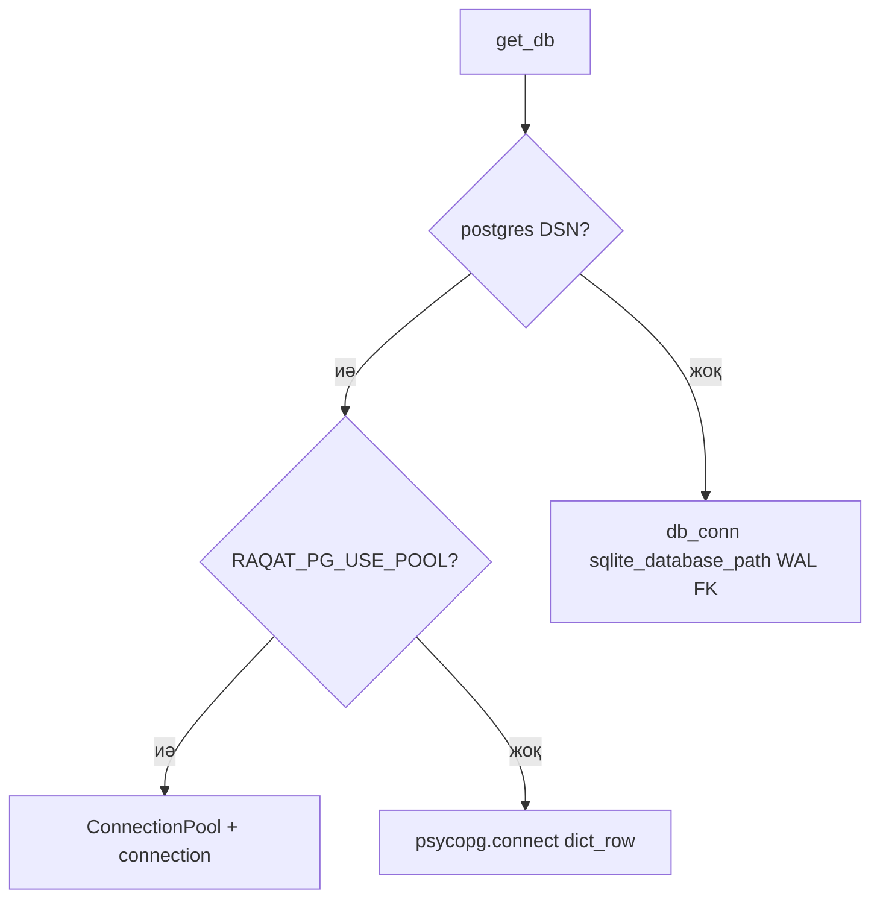

# Өнім ұстанымы және мақсат

> Архив §1. [vision-positioning.md](../roadmap/vision-positioning.md) — §38.

---

## 1. Өнім мақсаты

RAQAT — исламдық контент пен құралдар: **Құран**, **хадис**, **намаз уақыты**, **құбыла**, **тәсбих**, **halal** (сурет), **дауыс + AI чат + TTS**.

**Адам үшін ұстаным:** RAQAT **адамға ең жеңіл** (түсінікті, аз басу), **ең оңай** (күнделікті іске қосуға ыңғайлы, шаршатпайтын) және **ең керек** (намаз · аят · дұға сияқты шын мәніндегі қажеттіліктерді бір орталықтан қамтамасыз ететін) **құрал** болуға тиіс. Күрделі мүмкіндіктерді де **қарапайым жолмен** жеткізу — жол картасы (**§24.0**, **§33–§38**) осы бағытты бекітуі керек.

### 1.0 Қолданбалар: ең күшті жақтары (RAQAT-қа қабылдау идеялары)

Төмендегі кесте — танымал ислам қолданбаларынан **UX/функция үздіктерін** қысқаша жинайды: копия емес, **өнім жол картасында** қай бағытты алуға болатынын талқылау үшін.

| Қолданба | Ең күшті жақтары (RAQAT-қа қабылдауға болады) |
|----------|------------------------------------------------|
| **Muslim Pro / Athan** | Дәл намаз уақыты (**8+ әдіс**), **Adhan** хабарламасы, **Құбыла**, мешіт / халал орындар іздеуі, **ислам күнтізбесі** |
| **Quran.com / Quran Majeed** | Таза оқу тәжірибесі, **көп аударма** (араб + **KK** + транслит), **тәпсір**, **сөз-сөз**, **бетбелгі**, **офлайн** |
| **Tarteel / Quranly** | **AI** оқу түзету (**тәжуид** кері байланыс), геймификация, күнделікті әдет **streak**, жаттау құралдары |
| **Pillars / Everyday Muslim** | Әдет трекері, намаз бақылауы, көрнекі прогресс, **Рамазан** фокусы |
| **IslamicFinder** | Қауымдастық, іс-шаралар, халал орындар, әлемдік мешіт дерекқоры |

**Мақсатты архитектура:** клиенттерде Gemini кілті болмайды; сұраулар **орталық `platform_api`** арқылы.  
**Қазіргі өткел:** `.env`-те `RAQAT_PLATFORM_API_BASE` және `RAQAT_AI_PROXY_SECRET` толтырылса, боттағы **барлық AI** (чат, halal сурет, дауыс транскрипциясы, TTS) **API арқылы** жүреді; әйтпесе ботта **`GEMINI_API_KEY`** тікелей `google-genai` қолданылады.

**Платформа пайдаланушысы:** Telegram `user_id` ↔ тұрақты **`platform_user_id`** (uuid), JWT ішінде `sub` / `telegram_user_id`. AI чат тарихы **бір кестеде** (`platform_ai_chat_messages`) — SQLite немесе PostgreSQL DSN бойынша; бот (`source=telegram`) мен API (`source=api`) бір JSON схемасымен оқылады.

### 1.1 Дерекқор абстракциясы (`db/get_db.py`)

**Негізгі идея:** өтпелі кезеңде бір **`with get_db() as conn:`** контекст менеджері — қосымша код **бір интерфейстен** (`conn.execute`, `fetchone`, …) жұмыс істейді; артқы жағы SQLite немесе PostgreSQL.

Нақты код (жалпы скетчтен айырмашылықтар):

| Тақырып | Реализация |
|---------|------------|
| PG қашан қосылады | `DATABASE_URL` **немесе** `DATABASE_URL_WRITER` мәнінің **`postgresql://...`** префиксі (`is_postgresql_configured()`). |
| DSN | **`postgresql_dsn()`** — алдымен `DATABASE_URL_WRITER`, содан `DATABASE_URL`. |
| Пул | **Әдепкі өшіқ**; `RAQAT_PG_USE_POOL=1` болғанда ғана **ленивті** `psycopg_pool.ConnectionPool` (`threading.Lock`, `RAQAT_PG_POOL_MIN` / `MAX`). |
| PG қосылым | Пулсыз: `psycopg.connect(dsn, row_factory=dict_row)`; барлығы контекст ішінде commit/close. |
| SQLite | Тікелей `sqlite3.connect` емес — **`db.connection.db_conn(sqlite_database_path())`**: WAL, `foreign_keys=ON`, `busy_timeout`. |
| Оқу/жазу бөлінісі | **`get_db_reader()`** / **`get_db_writer()`** — келешекте `DATABASE_URL_READER` / writer; қазір writer = `get_db()`. |
| Shutdown | **`close_postgresql_pools()`** — uvicorn lifespan / тест соңы. |
| SQL диалектісі | **`db/dialect_sql.py`** — плейсхолдер (`?` ↔ `%s`), уақыт, `INSERT OR IGNORE` / `ON CONFLICT` үйлесімі (PG көшуі). |

Толығырақ: `docs/MIGRATION_SQLITE_TO_POSTGRES.md` §4.

### 1.2 Сәйкестендіру және байлау (Identity & Linking)

**Экожүйенің тірегі:** Telegram `user_id` ↔ **`platform_user_id`** (uuid) ↔ JWT **`sub`** ↔ `platform_identities` / `platform_ai_chat_messages`.

| Қадам | Сипат |
|-------|--------|
| UUID құру/табу | `db/platform_identity_chat.ensure_platform_user_for_telegram` — кестеде жол жоқ болса uuid INSERT; қайталау race-інде unique constraint + қайта оқу. **PostgreSQL:** `DATABASE_URL` болса `_platform_db` → `get_db_writer()` (sqlite `db_path` елемейді); әйтпесе `db_conn(db_path)`. |
| JWT + tg бір уақытта | **`POST /api/v1/auth/link/telegram`**: дене `{ "telegram_user_id": int }`, header **`X-Raqat-Bot-Link-Secret`** = ортадағы `RAQAT_BOT_LINK_SECRET` — жауапта **access (+ refresh)**, `sub` = uuid, `telegram_user_id` claim. |
| Боттағы чат | `handlers/ai_chat.py` → **`append_telegram_ai_turn`** → сол uuid кеңістігінде хабарламалар (`source=telegram`). |
| API чат | `POST /api/v1/ai/chat` (JWT uuid `sub` болса) → **`append_ai_exchange`** (`source=api`). |

**Мақсатты сценарий (мобильді / бот интеграциясы):** `/start` кезінде бот **`RAQAT_PLATFORM_API_BASE`** + **`RAQAT_BOT_LINK_SECRET`** орнатылғанда **`POST /api/v1/auth/link/telegram`** шақырады (`services/platform_link_service.py`) — identity құрылады/табылады, **JWT** жауабы `user_preferences.platform_token_bundle`-да сақталады. Мобильді клиент өз JWT-сін алғанда **сол uuid** бойынша `/users/me/history` қолдана алады.

#### Telegram → AI чат → API (бір қолданушы ағыны)

| Қадам | Не болады |
|-------|-----------|
| 1. `/start` | `log_event` → **`ensure_telegram_linked_on_platform`** (опция): API **`ensure_platform_user_for_telegram`** + JWT; тіл таңдау / меню / onboarding. |
| 2. AI чатқа кіру + хабарлама | `handlers/ai_chat.py`: rate limit → `ask_genai` → **`append_telegram_ai_turn`**. |
| 3. Жүйе: identity | Егер §1 қадам link орындалған болса — uuid бұрыннан бар; әйтпесе **`append_telegram_ai_turn`** ішінде **`ensure_platform_user_for_telegram`**. |
| 4. Жүйе: тарих | `append_ai_exchange`: **`platform_ai_chat_messages`** — `user` және `assistant`, **`source=telegram`**. |
| 5. API: JWT | `/start` link сәтті болса — жауап сақталған **`access_token`** (немесе қолмен **`POST /auth/link/telegram`**). |
| 6. API: профиль | **`GET /api/v1/users/me`** (Bearer) — `platform_user_id`, `telegram_user_id`, scopes т.б. |
| 7. API: тарих | **`GET /api/v1/users/me/history`** — сол uuid бойынша хабарламалар (`items`, `next_before_id`). |

Ескертпе: **`RAQAT_PLATFORM_API_BASE` / `RAQAT_BOT_LINK_SECRET` бос болса**, link өтпейді — identity+тарих әлі де AI алғашқы айналымынан кейін пайда болады, JWT ботта сақталмайды. Синтетикалық тексеру: `scripts/dev_verify_platform_flow.py`.

Код: `platform_api/auth_routes.py`, `db/platform_identity_chat.py`, `db/dialect_sql.py`.

### 1.3 Метадеректер синхроны (`GET /api/v1/metadata/changes`)

Офлайн / инкременттік жаңарту үшін **incremental diff** (мобильді: `contentSync.ts`, `If-None-Match` + `since`).

| Параметр / тақырып | Сипат |
|--------------------|--------|
| **ETag** | Дерекқор күйінің қысқа хэші; клиент **`If-None-Match`** жіберсе, өзгеріс жоқ болса **`304 Not Modified`**. |
| **Last-Modified** | Соңғы өзгеріс уақыты (күй хэшімен бірге). |
| **`since` (query)** | ISO8601; DB-да `quran`/`hadith` **`updated_at`** болса, жауапта **`since_normalized_sqlite`**, **`incremental_diff_available`**, өзгерген id тізімдері: **`quran_changed`**, **`hadith_changed`**. |
| **Diff** | Толық мәтін емес — **өзгерген сүрелер/хадис id-лері** (желінің көлемін азайту). |

Код: `platform_api/content_routes.py`, `content_reader.py`.

---
