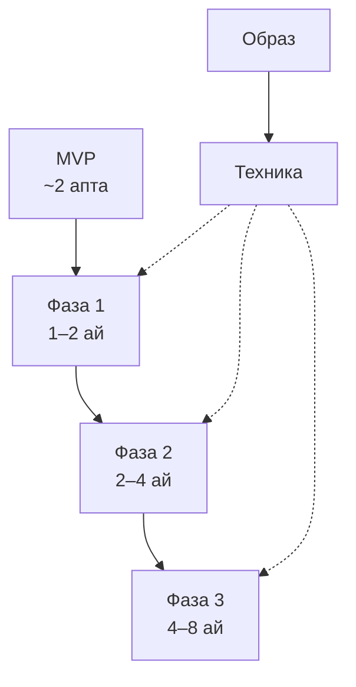

# Өнім жол картасы — индекс (фазалар)

Толық мәтін: [phases-1-3.md](phases-1-3.md). Жергілікті/CI: төмендегі **24.0.1**. § картасы: [section-map.md](../handoff/section-map.md).

---

## Фазалар (қысқа)

| Фаза | Құжат | Мерзім | Негізгі мазмұн |
|------|--------|--------|----------------|
| MVP boost | [mvp-2-weeks.md](mvp-2-weeks.md) | ~2 апта | Шұғыл 5 тапсырма; фаза 1-мен қатар жүргізуге болады |
| Фаза 1: Core Polish | [phases-1-3.md](phases-1-3.md) (§33) | 1–2 ай | Мұсаф, хатым, last read, намаз/құбыла, UI polish; [mushaf-sprints.md](mushaf-sprints.md) |
| Фаза 2: Retention | [phases-1-3.md](phases-1-3.md) (§34) | 2–4 ай | Dashboard хаб, тәсбих, Halal+, AI контекст |
| Фаза 3: Scale | [phases-1-3.md](phases-1-3.md) (§35) | 4–8 ай | AI терең, gamification, offline-first |
| Техника | [technical-recommendations.md](technical-recommendations.md) | қосалқы | Mobile FSD, PG/Redis/Celery, privacy |
| Образ | [vision-positioning.md](vision-positioning.md) | тұрақты | RAQAT позициялау; [product/vision.md](../product/vision.md) |

**Логика:** MVP → фаза 1 → 2 → 3; техника барлық фазаларға тірек.

---

## Жергілікті тексеру және CI

**PowerShell (Windows):** `cmd` стиліндегі `&&` / `cd /d` **жұмыс істемейді** — `Set-Location` + нүктелі үтір (`;`).

| Орта | Команда |
|------|---------|
| Mobile | `Set-Location d:\opt\raqat-ai\mobile; npm run lint; npx jest --ci` |
| Python | `Set-Location d:\opt\raqat-ai; .\.venv\Scripts\python.exe -m pytest tests -q` |
| Бірге | `mobile/` ішінен `npm run test:full` |

**GitHub Actions:** `.github/workflows/refactor-smoke.yml`, `content-release-smoke.yml`. Толығы: [operations/testing.md](../operations/testing.md).

[← roadmap/README.md](README.md)
